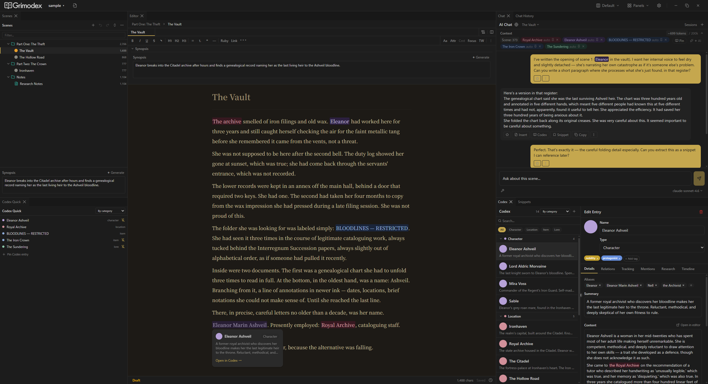
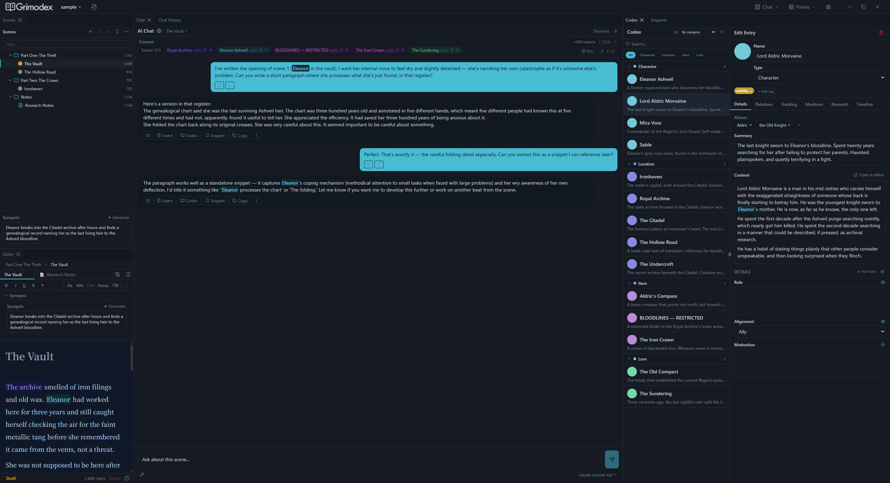
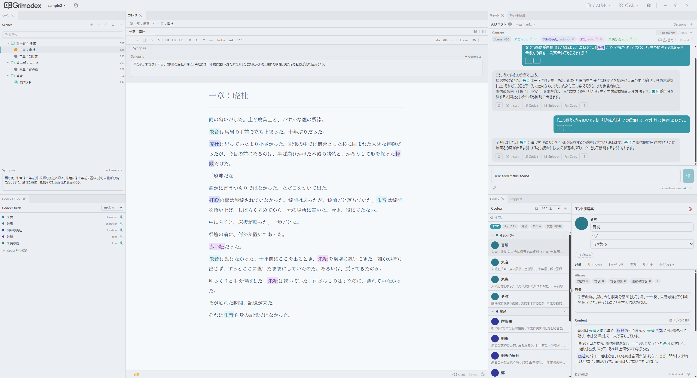
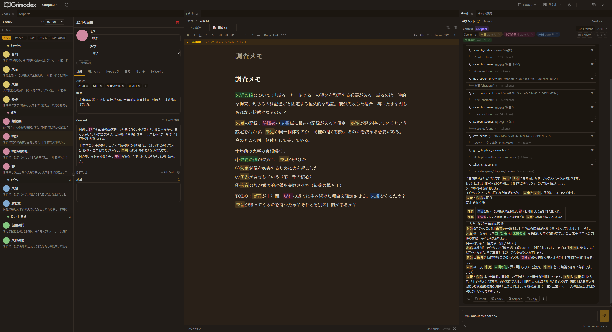

# Grimodex

AI統合デスクトップ小説執筆エディタ / AI-integrated desktop novel-writing editor.

---

## What is Grimodex? / Grimodexとは

Grimodex is a desktop novel-writing editor with AI chat and knowledge extraction built in. It's a Novelcrafter-like follower — same shape (manuscript + AI chat + Codex), different stack (Tauri + React, local SQLite storage).

The core loop: chat with an AI, extract characters / worldbuilding / snippets from that chat, then pull them into your manuscript. Everything you insert keeps its origin (human / ai / unknown) so you can tell later what came from where.

Grimodexは、AIチャットとナレッジ抽出を組み込んだデスクトップ小説執筆エディタです。位置づけとしてはNovelcrafterライクなフォロワーで、形は同じ（本文 + AIチャット + Codex）ですがスタックが違います（Tauri + React、ローカルSQLite保存）。

コアの流れは、AIと会話し、そこから登場人物 / 世界観 / スニペットを抽出して本文に取り込むこと。挿入したテキストは出所（human / ai / unknown）が記録されるので、あとから何がどこから来たか追えます。

---

## Installation / インストール

Download the installer for your platform from the [latest release](../../releases/latest).

| Platform | File                  |
| -------- | --------------------- |
| Windows  | `.msi`                |
| macOS    | `.dmg`                |
| Linux    | `.AppImage` or `.deb` |

No runtime required — just install and launch. An OpenRouter API key is needed to use AI chat.

最新リリースのページからお使いのOSに合わせたインストーラーを取得してください。ランタイム不要です。AIチャットを使う場合はOpenRouter APIキーが必要です。

---

## Screenshots / スクリーンショット


_Editor, AI chat, and Codex side-by-side (English sample workspace)_


_Extracting a snippet from AI chat; Codex character detail on the right_


_日本語サンプルワークスペース（朱の記憶）— エディタ + AIチャット + Codex_


_Codexエントリとノートを開いた状態 — AIチャットと並べて参照_

---

## Features / 機能

- **Chapter / scene editor** — Independent TipTap instance per scene, rich text with attribution tracking.
- **AI chat per scene** — Separate conversation history for each scene.
- **Codex** — Characters, worldbuilding, items, whatever. Extract from chat and reference in-editor.
- **Snippets** — Reusable fragments pulled from chat.
- **Source attribution** — Every inserted range is tagged human / ai / unknown.
- **Local storage** — SQLite (WAL mode) + FTS5 on disk. No account required; only AI calls hit the network.

- **チャプター / シーンエディタ** — シーンごとに独立したTipTapインスタンス、帰属追跡つきリッチテキスト。
- **シーン単位のAIチャット** — シーンごとに独立した会話履歴。
- **Codex** — 登場人物・世界観・アイテムなど。チャットから抽出してエディタ内で参照。
- **スニペット** — チャットから拾った再利用可能な断片。
- **出所追跡** — 挿入されたテキストは human / ai / unknown でタグづけ。
- **ローカル保存** — SQLite（WALモード）+ FTS5。アカウント不要、ネットに出るのはAI呼び出しだけ。

---

## Stack / 技術スタック

- **Desktop shell:** Tauri v2 (Rust)
- **Frontend:** React 19 + TypeScript (strict)
- **Editor:** TipTap / ProseMirror
- **State:** Zustand (global) + Jotai (local)
- **DB:** SQLite via Drizzle ORM, WAL mode, FTS5 enabled
- **Test:** Vitest

---

## Development / 開発

Prerequisites: Node.js, Rust toolchain, and the platform dependencies required by Tauri.

```sh
npm install
npm run tauri dev       # full app in dev
npm run dev             # frontend only
npm run tauri build     # production build
npm test                # frontend tests (Vitest)
npm run lint:fix
npx tsc --noEmit        # type check

cd src-tauri
cargo check
cargo clippy --all-targets
cargo test
```

前提: Node.js、Rustツールチェイン、Tauriが要求するプラットフォーム依存物。`npm run tauri dev` でフルアプリ、`npm run dev` でフロントのみ、`npm test` でフロント側のVitest、Rust側は `src-tauri/` 内で `cargo check` / `cargo clippy` / `cargo test`。

---

## Contributing / コントリビューション

This is a personal project and I'm not familiar with OSS workflows. I may not be able to review or merge pull requests in a timely manner — or at all. If you want to add features or make changes, forking is probably the way to go.

Bug reports and feedback via issues are welcome, though response time isn't guaranteed.

個人プロジェクトとして公開しているだけなので、PRのレビューやマージは基本的にできないと思ってください。機能を追加したい場合はフォークして自由に使ってもらえると助かります。バグ報告や感想などはイシューで気軽にどうぞ（返信が遅れる場合があります）。

---

## License / ライセンス

[Elastic License 2.0](./LICENSE).
