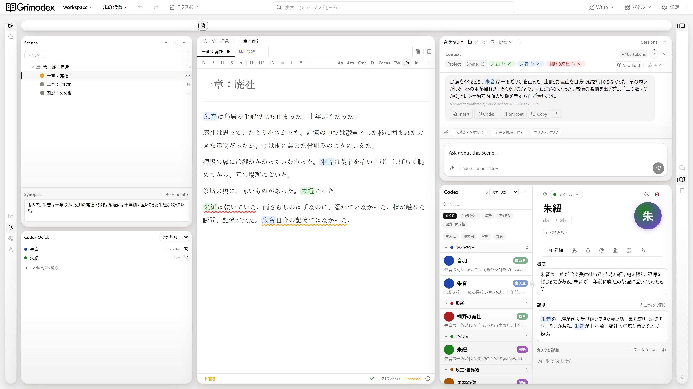
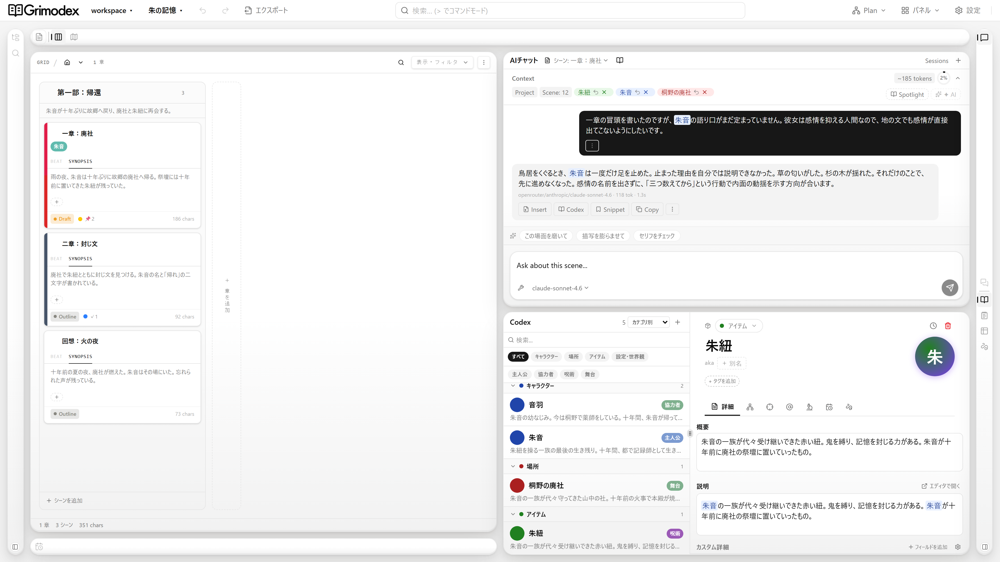
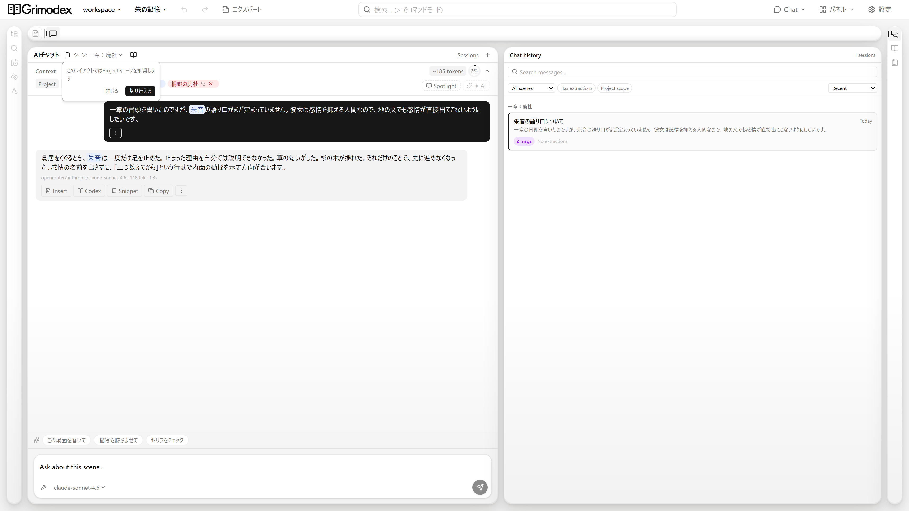

# Grimodex

AI統合デスクトップ小説執筆エディタ / AI-integrated desktop novel-writing editor.

---

## What is Grimodex? / Grimodexとは

Grimodex is a desktop novel-writing editor with AI chat and knowledge extraction built in. It's a Novelcrafter-like follower — same shape (manuscript + AI chat + Codex), different stack (Electron + React, local SQLite storage).

The core loop: chat with an AI, extract characters / worldbuilding / snippets from that chat, then pull them into your manuscript. Everything you insert keeps its origin (human / ai / unknown) so you can tell later what came from where.

Grimodexは、AIチャットとナレッジ抽出を組み込んだデスクトップ小説執筆エディタです。位置づけとしてはNovelcrafterライクなフォロワーで、形は同じ（本文 + AIチャット + Codex）ですがスタックが違います（Electron + React、ローカルSQLite保存）。

コアの流れは、AIと会話し、そこから登場人物 / 世界観 / スニペットを抽出して本文に取り込むこと。挿入したテキストは出所（human / ai / unknown）が記録されるので、あとから何がどこから来たか追えます。

---

## User guide / 利用ガイド

利用者向けの現行手順は、リポジトリ管理の[Grimodex User Guide](docs/user-guide/ja/Home.md)にまとめています。インストール、10分クイックスタート、AI接続、保存・復旧、トラブルシューティングを目的別に確認できます。

## Installation / インストール

Download the installer for your platform from the [latest release](https://github.com/kazormia296/Grimodex/releases/latest).

| Platform | File                           |
| -------- | ------------------------------ |
| Windows  | `.exe`                         |
| macOS    | `.dmg`                         |
| Linux    | `.AppImage`, `.deb`, or `.rpm` |

No runtime required — just install and launch. AI chat works with a cloud API key (OpenRouter / OpenAI / Anthropic), a local Ollama model, or an agentic CLI — see Features below.

最新リリースのページからお使いのOSに合わせたインストーラーを取得してください。ランタイム不要です。AIチャットはクラウドのAPIキー（OpenRouter / OpenAI / Anthropic）、ローカルのOllama、エージェント型CLIのいずれかで利用できます（詳細は下記の機能を参照）。

---

## Screenshots / スクリーンショット


_Write — エディタ・AIチャット・Codex を並べた執筆ビュー（日本語サンプル「朱の記憶」）_


_Plan — シーンをカードで俯瞰するプランニングビュー_


_Chat — AIチャットと会話履歴を並べたビュー_

---

## Features / 機能

- **Chapter / scene editor** — Independent TipTap instance per scene, rich text with attribution tracking.
- **Japanese novel typesetting** — Ruby (furigana), emphasis dots (傍点), and a vertical-writing preview.
- **Prose linter** — Deterministic Japanese text checks backed by UniDic morphological analysis.
- **AI chat per scene** — Separate conversation history for each scene.
- **Flexible AI backends** — Bring your own cloud API key (OpenRouter / OpenAI / Anthropic), use an OpenAI-compatible endpoint or supported provider, run a local model via Ollama, or drive an agentic CLI you already use (Claude Code / Codex CLI / OpenCode).
- **MCP server** — Grimodex ships an MCP server, so external agents can read and edit your project.
- **Codex** — Characters, worldbuilding, items, whatever. Extract from chat and reference in-editor.
- **Snippets** — Reusable fragments pulled from chat.
- **Source attribution** — Every inserted range is tagged human / ai / unknown.
- **Local storage** — SQLite (WAL mode) + FTS5 on disk. No account required. Manuscripts leave the device only when you explicitly send context to a configured AI; Electron may also contact services for license validation, update checks, and semantic-model downloads.

- **チャプター / シーンエディタ** — シーンごとに独立したTipTapインスタンス、帰属追跡つきリッチテキスト。
- **日本語小説向け組版** — ルビ（ふりがな）、傍点、縦書きプレビュー。
- **文章リンター** — UniDic形態素解析ベースの決定論的な日本語文章チェック。
- **シーン単位のAIチャット** — シーンごとに独立した会話履歴。
- **柔軟なAIバックエンド** — クラウドのAPIキー持ち込み（OpenRouter / OpenAI / Anthropic）、OpenAI互換エンドポイントや対応プロバイダー、Ollamaによるローカルモデル、または手持ちのエージェント型CLI（Claude Code / Codex CLI / OpenCode）。
- **MCPサーバー** — GrimodexはMCPサーバーを同梱。外部エージェントからプロジェクトを読み書きできます。
- **Codex** — 登場人物・世界観・アイテムなど。チャットから抽出してエディタ内で参照。
- **スニペット** — チャットから拾った再利用可能な断片。
- **出所追跡** — 挿入されたテキストは human / ai / unknown でタグづけ。
- **ローカル保存** — SQLite（WALモード）+ FTS5。アカウントは必須ではありません。原稿本文が端末外へ出るのは、設定したAIへユーザーが明示的にコンテキストを送る場合です。Electron版では、これとは別にライセンス検証、更新確認、意味検索モデル取得の通信が発生する場合があります。

---

## Stack / 技術スタック

- **Desktop shell:** Electron (Chromium)
- **Frontend:** React 19 + TypeScript (strict)
- **Native bridge:** typed preload IPC + N-API (Rust)
- **Editor:** TipTap / ProseMirror
- **State:** Zustand (global) + Jotai (local)
- **DB:** Drizzle ORM + SQLite/rusqlite, WAL mode, FTS5 enabled
- **Semantic search:** Ruri v3 embeddings (ONNX Runtime) + UniDic morphology (lindera)
- **MCP:** standalone Rust sidecar sharing the application crates
- **Test:** Vitest + Playwright Electron smoke tests

The supported runtime is Electron. The Tauri app package at the `src-tauri` root remains in the tree as frozen legacy code for v1 compatibility and migration validation; active Rust domain crates under `src-tauri/crates/` are shared by the Electron N-API module and the standalone MCP server.

サポート対象のランタイムは Electron です。`src-tauri` 直下の Tauri app package は v1 互換・移行検証用の frozen legacy として残しています。一方、`src-tauri/crates/` の Rust ドメイン実装は Electron の N-API モジュールと standalone MCP サーバーから引き続き共用します。

---

## Development / 開発

Prerequisites: Node.js 20+, pnpm, and a stable Rust toolchain. Python 3 is needed only when regenerating the embedding model. Electron bundles Chromium, so an external web-engine SDK is not required.

```sh
pnpm install
pnpm napi:build          # build the Rust N-API module (first run / after Rust changes)
pnpm electron:dev       # full desktop app in dev
pnpm dev                # frontend only
pnpm electron:build     # production JavaScript build
pnpm electron:package   # native release artifacts + platform package
pnpm test               # frontend tests (Vitest)
pnpm test:electron --run
pnpm electron:smoke
pnpm lint:fix
npx tsc --noEmit        # type check

cargo check --manifest-path electron/native/grimodex-node/Cargo.toml
cargo test --manifest-path src-tauri/Cargo.toml --workspace --exclude grimodex --features grimodex-semantic/semantic-embedding
```

### First-build setup / 初回ビルドの準備

- **N-API, ONNX Runtime & UniDic** — Run `pnpm napi:build` before the first Electron launch and after native Rust changes. The first Rust build downloads the ONNX Runtime binaries (`ort`) and the UniDic dictionary (`lindera`, embedded for the Japanese prose linter). Network access is required, so the first build is slow.
- **Embedding models** — Large ONNX model files are neither committed nor bundled. The packaged app downloads the language-specific, SHA-256-pinned `model_int8.onnx` from the `semantic-models-v1` GitHub Release on first use; tokenizer files are bundled. Normal development does not require a local model. Only when updating a published model asset, regenerate it from the upstream weights and update the pinned URL/hash:

  ```sh
  pip install "optimum[onnxruntime]" sentencepiece protobuf
  python3 scripts/export-ruri-onnx.py
  ```

  The files are written to `src-tauri/resources/semantic/ruri-v3-30m/` for verification and upload; the ONNX file is not included in the desktop package. Passing `--no-default-features` to a targeted Cargo command remains available for pure-logic work, while the active CI gate explicitly enables `grimodex-semantic/semantic-embedding`.

初回起動前と native Rust 変更後は `pnpm napi:build` を実行してください。初回のRustビルドでは ONNX Runtime バイナリ（`ort`）と UniDic 辞書（`lindera`、日本語リンター用に同梱）がダウンロードされます（ネットワーク必須・初回は時間がかかります）。大きな埋め込みモデルはリポジトリにもデスクトップパッケージにも含めず、言語別の `model_int8.onnx` を初回利用時に `semantic-models-v1` GitHub Release から取得して、固定SHA-256で検証します。tokenizerは同梱済みなので、通常の開発でモデル生成は不要です。配布モデルを更新するときだけ上記exportを実行し、assetのURL/hashも更新してください。pure-logicだけを対象にする個別Cargoコマンドでは`--no-default-features`も使えますが、現行CIは`grimodex-semantic/semantic-embedding`を明示して実経路を検証します。

---

## Contributing / コントリビューション

This is a personal project and I'm not familiar with OSS workflows. I may not be able to review or merge pull requests in a timely manner — or at all. If you want to add features or make changes, forking is probably the way to go.

Bug reports and feedback via issues are welcome, though response time isn't guaranteed.

個人プロジェクトとして公開しているだけなので、PRのレビューやマージは基本的にできないと思ってください。機能を追加したい場合はフォークして自由に使ってもらえると助かります。バグ報告や感想などはイシューで気軽にどうぞ（返信が遅れる場合があります）。

---

## License / ライセンス

[Elastic License 2.0](./LICENSE).
