# ADR 012 — Work Layer参照プロトタイプ

[ADR 012本文](../../012-work-focus-chat-and-context-boundary.md) の補助資料。
2026-09-15の文書化に使用した、作者が会話に添付した15枚のスクリーンショットを対象とする。

**旧プロトタイプの参照資料であり、最終UI仕様やruntimeの実装証拠ではない。**
画像中の物語・候補・Run情報・SAFE判定・状態名・処分説明を、実際の契約や検証結果として扱わない。

## 今回の決定との差分

- Task Tray／All WorkをWork管理の入口とする。Task情報を複製する常駐Work詳細は増設しない。
- 通常ChatとWorkScoped Chatは共通パネルで、独立したSessionとして扱う。
  画像にはこの新しいWorkScoped Chatの完成図は含まれていない。
- 旧Lens／Resolved／Portalの右上重ね表示を採用しない。Resolve中だけright stripe最上段に
  単体close不可・カード角丸なしの専用パネルを置き、強調枠はパネルとStripeアイコンへ適用する。
- Projection／Review／Batchの全面作業ビューと、Deep Inspectionの大型モーダルは区別する。
- 参照プレビューをそのままモデルへ送ること、Focus切り替えでWork状態を変えることは認めない。
- 表示されたSAFE、再浮上、旧結果fallbackなどの詳細は既存の権限・Scope・Freshness契約を優先する。

## 原本と同一性

原本PNGは改変・再圧縮・生成による置換をせず、参照しやすいASCII名へ変更する。
15枚は各1556×1014、合計3,058,053 bytes。
[manifest.json](manifest.json) に元ファイル名、順番、状態、byte数、SHA-256、Git blob SHA-1を記録する。
機密性の異なる外部画像ホストは使用しない。Claude共有URLやオンライン実行環境がなくても参照可能な
リポジトリ内PNGを最終形とする。元ZIPのHTML／support.jsは実行・同梱を要求しない。

## 画像取り込み状況

PNG 15枚をリポジトリ内へ追加済み。以下の目録とギャラリーから参照できる。

## 画像の目録

| # | 状態 | PNGファイル | 今回の読み方 |
| --- | --- | --- | --- |
| 01 | ARRIVE +1 | `01-arrive.png` | ヘッダーのFocus・Attention・Systemという入口。Work詳細の常駐を要求しない。 |
| 02 | TRAY · FOCUS | `02-tray-focus.png` | Focused Work、作者Task、LATERをトレイで扱う。 |
| 03 | TRAY · ATTN | `03-tray-attention.png` | Finding／Attentionは作者が引き受けたWorkTaskと同一ではない。 |
| 04 | ALL WORK | `04-all-work.png` | 一覧から閲覧することと、Focusへ選ぶことを分離する。 |
| 05 | LENS | `05-resolve-lens.png` | 旧案。右上への重ね表示と画面外周フレームは採用せず、right stripe最上段の専用Resolveパネル・アイコンへ移す。 |
| 06 | RESOLVED | `06-resolved.png` | 判断・再評価の区別は参照できるが、右上に重ねる表示方式は採用しない。 |
| 07 | PORTAL | `07-context-portal.png` | 必要な根拠をその場で参照する発想を維持。モーダレスの重ね窓は採用しない。 |
| 08 | INSPECT | `08-deep-inspection.png` | 来歴の一時的な詳細検査。下のLENSは「アリス」だが詳細はEvidence消失を示しており、ID連続性の実装証拠にはしない。 |
| 09 | PROJECTION | `09-resolve-projection.png` | 作業領域全体を一時的に切り替える表示。Work会話のための必須画面にはしない。 |
| 10 | REVIEW | `10-change-review.png` | 承認済み状態と提案の比較、および根拠・影響の提示。 |
| 11 | BATCH | `11-batch-review.png` | 一括レビューの参考。SAFEの文言や表示された適用可否を、本ADRで新たに批准しない。 |
| 12 | SYS · RUN | `12-system-running.png` | System maintenanceの実行表示。作者Taskの完了率とは別。 |
| 13 | BLOCKED | `13-system-blocked.png` | 障害表示の参考。「最後の結果を返す」という旧説明は現行Freshness／開示契約を上書きしない。 |
| 14 | EMPTY | `14-focus-empty.png` | Focusなしを正常な状態として扱う。次の仕事を自動選択しない。 |
| 15 | DISPOSED | `15-disposed-attention.png` | 処分済みAttentionの別扱い。再浮上やidentityの厳密な挙動は既存契約に従う。 |

## ギャラリー

### 01 — ARRIVE +1

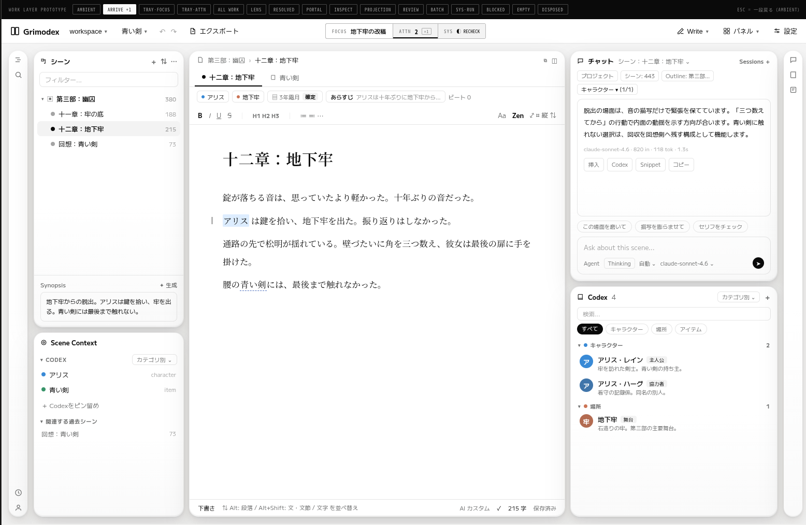

### 02 — TRAY · FOCUS

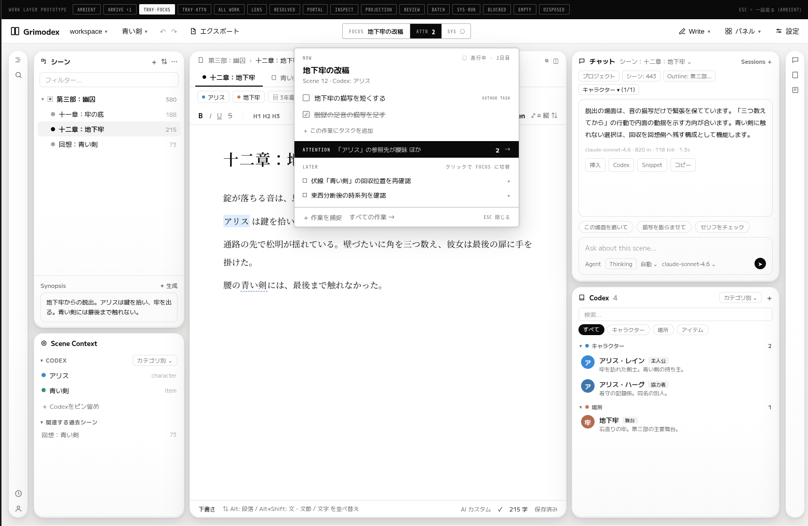

### 03 — TRAY · ATTN

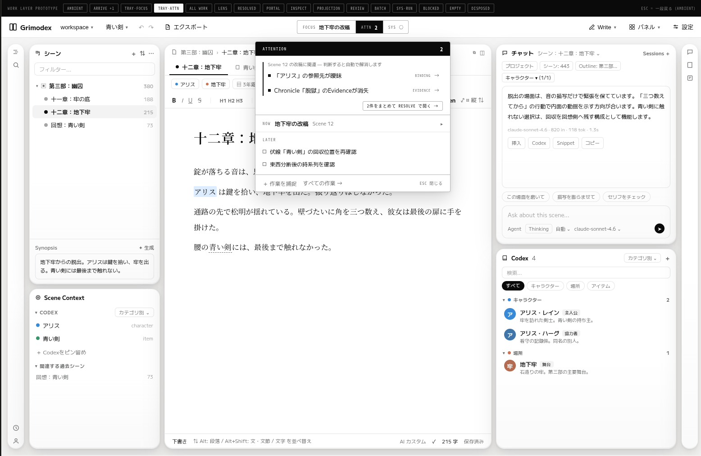

### 04 — ALL WORK

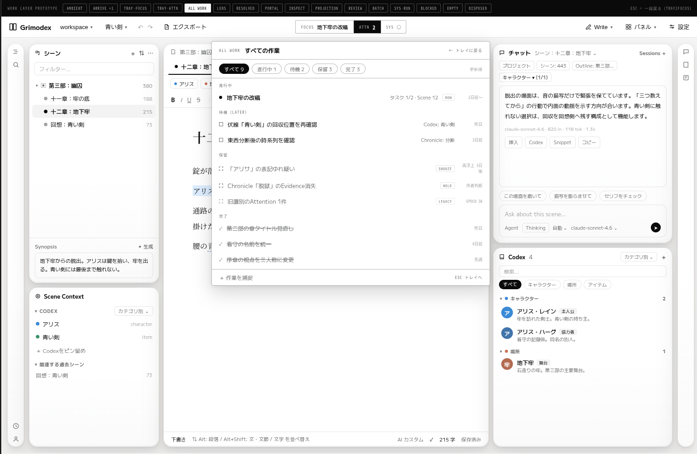

### 05 — LENS

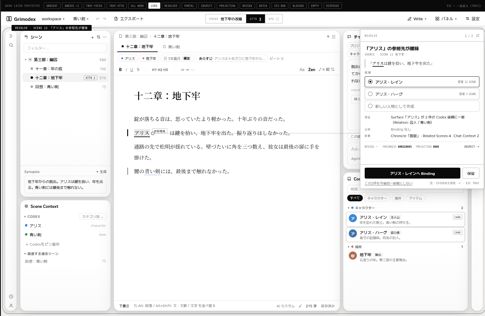

### 06 — RESOLVED

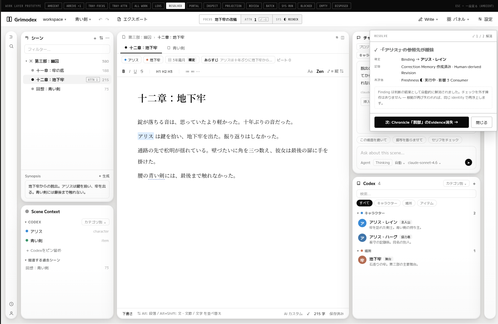

### 07 — PORTAL

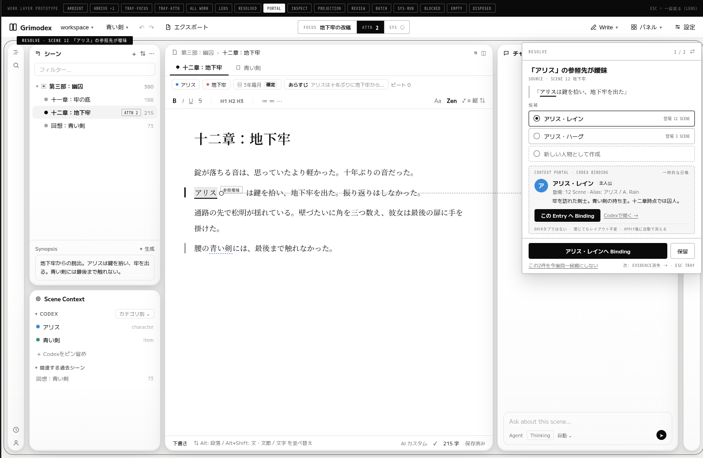

### 08 — INSPECT

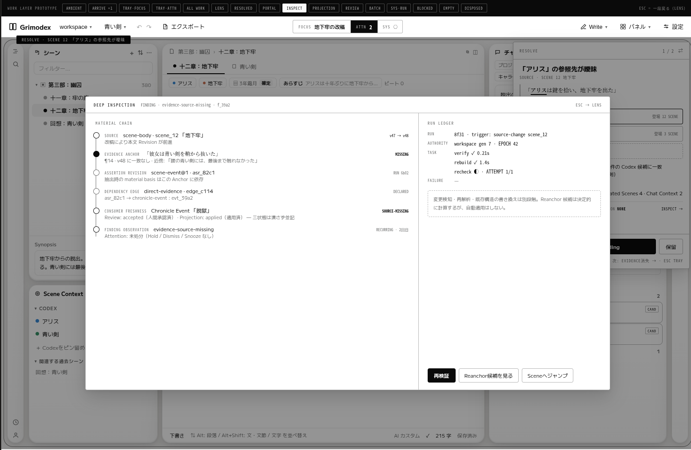

### 09 — PROJECTION

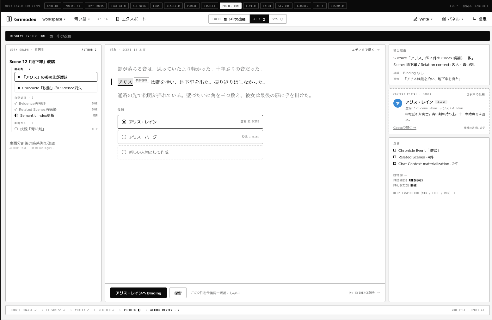

### 10 — REVIEW

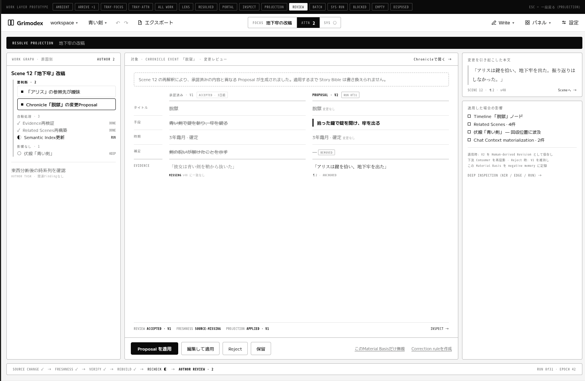

### 11 — BATCH

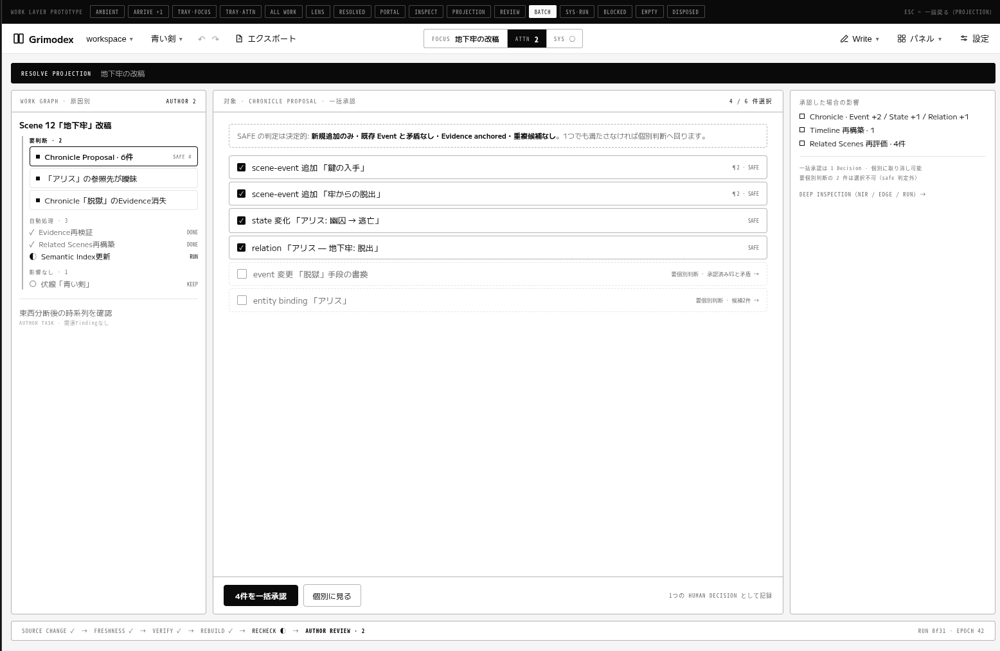

### 12 — SYS · RUN

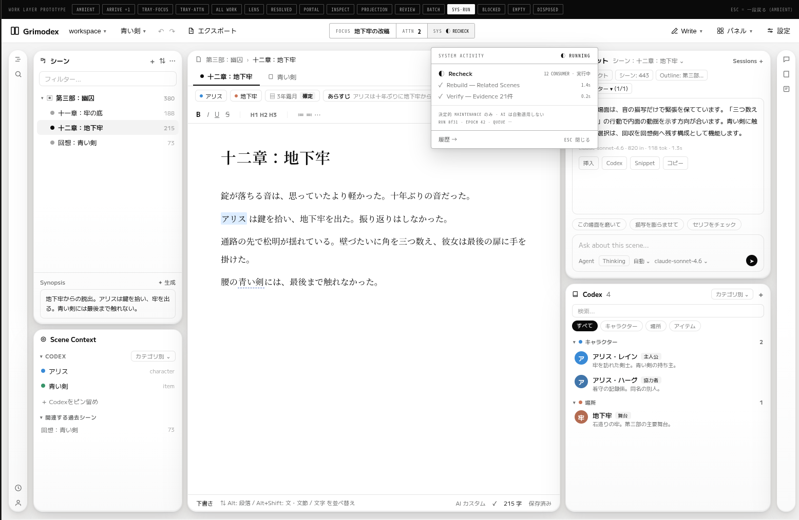

### 13 — BLOCKED

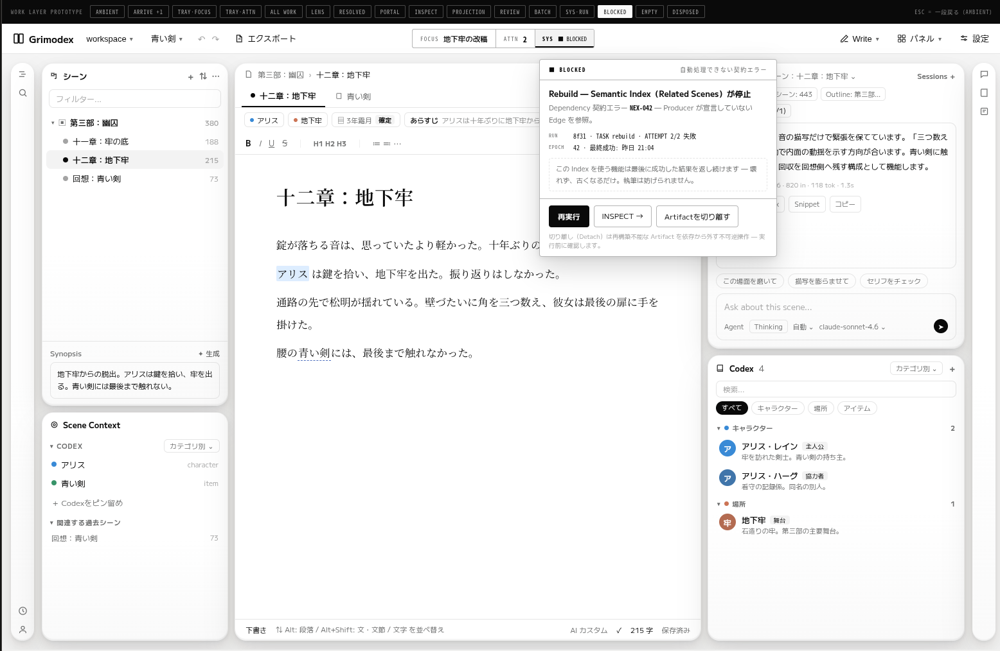

### 14 — EMPTY

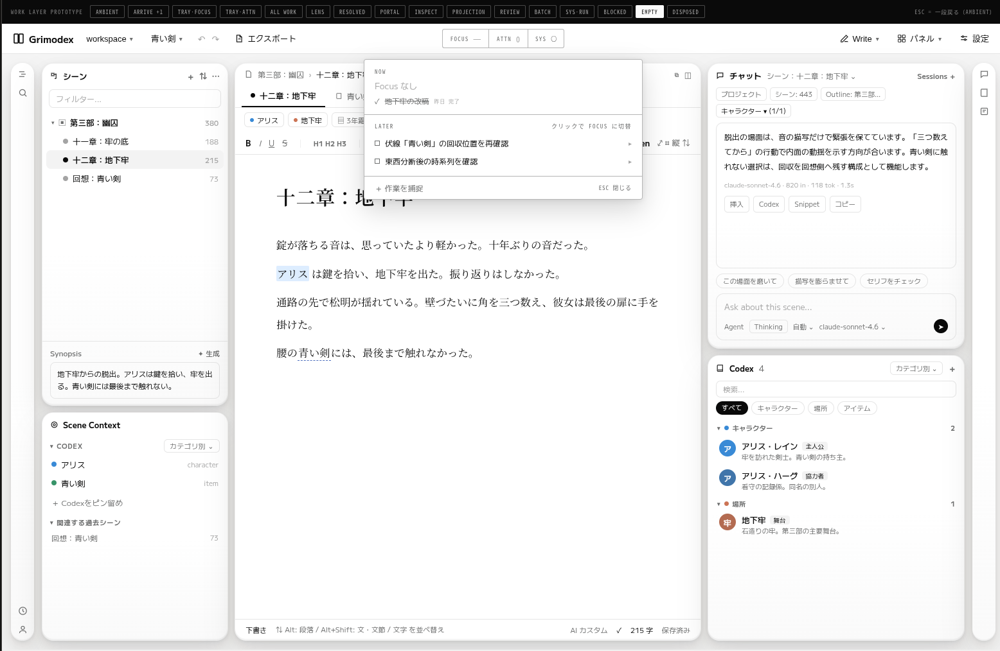

### 15 — DISPOSED

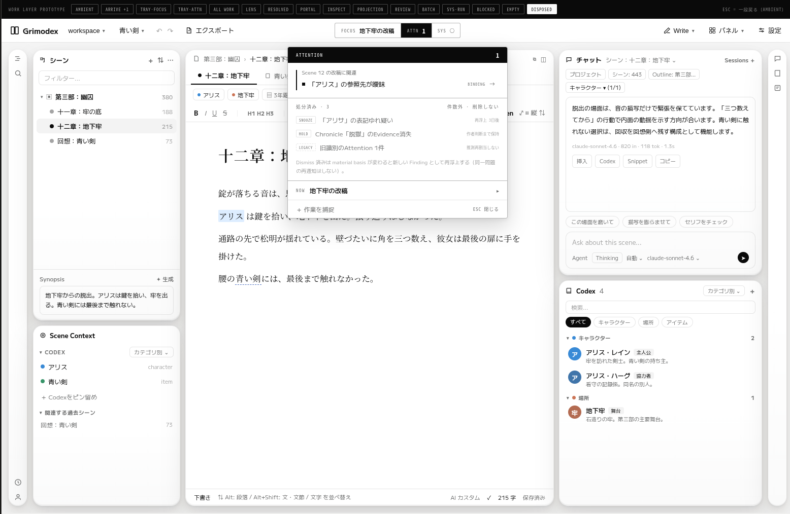

## HTMLモック

[操作可能なHTMLモックとローカル直開きの手順](mock/README.md) を同梱する。
元のDesign Component書き出しは`file://`上で起動HTMLとsibling componentを`fetch()`するため
CORSで失敗していた。保存版ではFrameをBlob resourceとして事前登録し、表示内容を変えずに
`prototype.dc.html`と`ui-study.dc.html`をブラウザから直接開けるようにしている。
