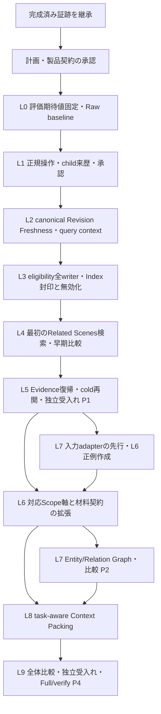

# NIR-1 統合実装計画

2026-09-09追記: [復旧受入れ第2版](nir1-recovery-acceptance-v2.md)をユーザーが承認した。旧根拠の即時失効、Rawの利用継続と操作応答性を必須とし、IR再生成2秒は改善目標、各種100回・計400回は必須gateから外す。固定Gold・B/D/T・開示境界は維持する。

2026-09-08追記: [A5候補2](nir1-a5-candidate-2.md)のIR専用floor、Raw順序維持＋最大1件追加、復旧正例probeの別版実装とL5検証が承認された。以下の初回A5算法は比較履歴として残し、現候補は追加policy版に従う。固定Gold・B/D/T・安全境界・受入れ条件は維持する。

Status: **条件反映済み・L0–L5 実行承認済み**。計画版 `nir1-plan/1`、初回製品threat model
`nir1-product-tm/1`。2026-09-08のユーザーによる計画への賛成と、指定修正後にL0からL5まで継続する指示を承認根拠とする。
承認は本書の初回製品policy・信頼境界・保存範囲・受入れ条件に束縛する。診断policyへの過去の承認は流用しない。
2026-09-08の固定実測で初回A5の品質がHoldとなり、ユーザーは検索表現・IR専用閾値・融合規則を
別候補として設計・local比較することを追加承認した。範囲と証跡は
[A5品質Holdと見直し範囲](nir1-l5-quality-hold.md) に記録する。本書の初回algorithm、固定Gold、
性能予算、信頼境界は、その追加承認だけで変更済み・達成済みとは扱わない。
L6–L9は全体計画に保持する。L6正例に必要なL7入力adapterの先行は許容するが、Graph検索利用の開示gateは省略しない。

2026-09-08、`codex/nir1-material-replay` の clean HEAD
`9bb942de7f58d869e9d5de52fb49d9adc49e965b`、tree
`3a7e9acca9b093362fc2615ffab60feee620813e` を調査した。これは計画作成前のコード識別子であり、
今後の実装候補や Full の証跡ではない。ローカル `origin/master` は `cf871087`。remote の更新確認は未実施。

## 1. 成果と計画の位置づけ

最初の製品成果は、**通常の抽出・編集・承認操作で作った解釈を、後続シーンの Related Scenes
で発見し、その解釈の Evidence に戻れること**。検索のための意味的な再抽出は行わない。
この成果を先に受け入れ、その共通契約を Graph、Context Packing / Chat へ展開して NIR-1 を完了する。

正本は [全体ロードマップ](narrative-semantic-core-roadmap.md)、
[ADR 005](../adr/005-narrative-semantic-core-boundary.md)、
[ADR 009](../adr/009-narrative-scope-relation-contract.md)、
[ADR 010](../adr/010-narrative-dependency-role-granularity-contract.md)、
[ADR 011](../adr/011-narrative-ir-revision-semantics-contract.md)。
[Related Scenes v3](nir1-related-scenes-precheck.md) の詳細設計と
[binding trace](nir1-binding-trace.md) は履歴・調査根拠として保持する。
本書承認後は、本書の実施順序・承認境界・受入れ手順を使用する。古い precheck の未解決事項は
以下の lane 内で解消し、診断ごとの再開承認や別途 reviewer 割当承認には戻らない。
診断policyの承認範囲自体は変更しない。

| NIR-1 正本の要件                                       | 本計画の担当     | 全体完了に必要な状態                                                                                              |
| ------------------------------------------------------ | ---------------- | ----------------------------------------------------------------------------------------------------------------- |
| Raw Text lexical retrieval                             | L0、L4、L8       | 現行 sparse / lexical 経路を比較対象として保存し、本文検索と exact quote の非回帰を確認                           |
| Raw Text dense retrieval                               | L0、L4、L8       | 現行 dense selector・モデル条件を固定し、IR 不可時に同じ Raw 結果を返す                                           |
| Narrative IR dense retrieval                           | L1–L5            | current・明示承認・Fresh な immutable Revision が封印済み Index を通じて検索に参加                                |
| 初期 Entity / Relation Graph traversal                 | L7               | 実在する identity と Evidence に結び付く探索が、開示判定を経て候補選択へ参加                                      |
| Pre-ranking disclosure                                 | L2、L6–L8        | phase / spoiler / Scope / knowledge holder / audience / Timeline / Worldline / narrative layer を順位計算前に評価 |
| Authority / Freshness / Scope / Evidence を使う fusion | L3–L4、L7        | 資格条件を hard gate として守り、適格候補だけを統合。関連度で拒否を上書きしない                                   |
| Task-aware Context Packing                             | L8               | task に必要な Raw Text と Evidence を残し、解釈の Review / Scope / Freshness / Evidence を消費先へ保持            |
| Hybrid 対 Raw baseline、選択改善、Evidence 復帰        | L0、L4–L5、L7–L9 | 事前固定した品質・性能条件と実製品 journey、独立受入れ、Quick / Full / verify を満たす                            |

Related Scenes の完了を NIR-1 全体の完了と呼ばない。M2 の全 Domain migration、M3 の
Correction Memory / semantic assertion override、M5 の Relation Path Explorer UI は今回の完了条件に含めない。
初期 Graph に必要な小さな Entity / Relation 接続は L7 に含め、M2 全体の完成を前提にしない。

## 2. 引き継ぐ完成済み証跡

保存先の基点は `/home/grimodex/Documents/Grimodex-evidence/nir1/`。
以下は保存済み結果を読み直したもの。今回、旧テストを新候補向けに再実行したという意味ではない。
membership の cold DB・golden・限定review、および Adapter cold DB の hash が保存台帳と一致することは再確認した。

| 証跡                                                                                                           | 完了として引き継ぐ内容                                                                                                                                                                                | この証跡が証明しないもの                                                                                            |
| -------------------------------------------------------------------------------------------------------------- | ----------------------------------------------------------------------------------------------------------------------------------------------------------------------------------------------------- | ------------------------------------------------------------------------------------------------------------------- |
| `20192fa6/ledger.json`、`original-evidence/`、`independent-review/`、commit `20192fa6`                         | 限定 Native recipe replay。独立 TS golden の request / component / Context Set seals と照合。9 source segments、2必要request、未選択spanを含む membership。欠落・不整合は部分集合を complete にしない | S2 開示、製品検索、Human-derived、Index、runtime liveness、全 recipe の対応                                         |
| `adapter-nonsecret-fixture/fixture.json`、`verification.json`、`independent-review.md`                         | 2つの nonsecret initial Revision。実 Adapter / Native 検証、UI 明示承認、cold reopen、元の `exact(S1)` と receipts の保持。S2 は抽出 snapshot に不在                                                  | 通常planner E2E。fixture は最初の永続化前だけ `secret:false` を注入した診断 build。child・検索・navigation は未証明 |
| `diagnostic-disclosure-policy/`、[承認済み診断policy](nir1-diagnostic-disclosure-policy.md)、commit `9bb942de` | `nir1.scene-body-reader-history/1` の診断承認。2 positive / 7 negative、全材料の S1 < S2、current/approval/Scope の独立判定、static contract の内容・版・digest 分類、DB不変、限定独立review          | 製品policy、canonical usability、eligibility writer coverage、activation、新規永続化、独立製品受入れ                |
| `canonical-freshness-readonly/README.md`、`summary.json`                                                       | 元の2 Revision の canonical `fresh` / `build_action:none`、current epoch、cursor=head=3、pendingなし。既存 Native graph verifier は clean / complete / consistent。Index 4面はゼロ                    | read validator の完成、live scheduler capability、mutation 後の無効化、search eligibility                           |
| `diagnostic-disclosure-commit/` と membership 台帳の Quick / verify                                            | 当時の precommit working candidate の Quick と直後の verify、review対象ファイルとの対応                                                                                                               | 現 HEAD の Full、今後の製品候補・merge・release の gate                                                             |

membership の初期対応 recipe は
`citation-id-v2/observation-v5/synthesis-v2/single-window/identity-merge/no-repair@1`。
Repair、多window、nonidentity merge、未知contractを complete に読み替えない。
診断fixtureを変更・再封印して製品positiveへ転用せず、新しい製品fixtureを正規操作から作る。
旧証跡の `/tmp` や uncommitted 表記は当時の記録として残し、保存先台帳・commitとの対応で読む。

## 3. 今回まとめて確認する承認事項

**A1–A8 を、下記ユーザー修正を含む実行契約として記録する。今回の継続実装範囲はL0–L5。**
診断policyへの過去の「承認します」は本表の承認として数えない。2026-09-08の追加指示を承認台帳に束縛する。
ユーザー修正: L6正例用L7入力adapterの先行許容（Graph利用gateは維持）、L8のprose最終requestに未承認情報を含めない、
L0で性能測定の起点・分母・復旧状態を固定、作者実測の受入れ上の位置づけを明記してから継続する。
**作者実測は技術受入れから分離する方式を選択する。** P1/P4の技術受入れを協力待ちで止めず、実測未取得は
`author-value: not-measured`として残す。作者確認時間の改善・一般的な利用者価値は、協力者による別の実測受入れが完了するまで主張しない。
これはA5/A7の承認対象に含む受入れ区分で、作者実測を自動テスト結果に置き換える変更ではない。
以下に収まる調査結果による関数配置・binding具体化・テスト追加・不具合修正は、同じ承認内で継続する。

| ID  | 今回の承認案                                                                                                                                                                                                                                           | 境界・受入れへの影響                                                                                                                                                                                                                                                                                                                                                                                        |
| --- | ------------------------------------------------------------------------------------------------------------------------------------------------------------------------------------------------------------------------------------------------------ | ----------------------------------------------------------------------------------------------------------------------------------------------------------------------------------------------------------------------------------------------------------------------------------------------------------------------------------------------------------------------------------------------------------- |
| A1  | L0–L9 の全体計画と、最初に L1–L5 の Related Scenes 製品経路を完成させる順序。範囲内の調査・実装・テスト・修正を継続                                                                                                                                    | 内部laneごとの再開確認は不要。節目P1–P4で成果・品質差・残件を報告。local検証用候補commitは gate 後に作成。push / PR / merge / release はこの計画承認に含めない                                                                                                                                                                                                                                              |
| A2  | 診断とは別の製品契約 `nir1.reader-history-product/1` を採用する提案。初回は scene-body、effective reading（auto→reading含む）、reader、非秘密、全story材料がS2より前                                                                                   | `exact(S1)` を保存し、assertionの成立場所S1と検索anchor S2を分ける historical-reference 用途だけに適用。既存 application の scene mismatch 拒否は維持。secret / story / 未解決・未対応制約は初回IRでは不可と表示                                                                                                                                                                                            |
| A3  | 正規UIで作る Human-derived `scope-override` と `projection-only` の連鎖を初回から対応。root replay + 各childの検証済みeffective material basisを使う                                                                                                   | 親の承認を継承せず current child を明示承認。Scope-resolution control入力を内容・role・versionで分類し、そのidentity/order/digestを資格判定だけに使う。全project authorityを「static」と免除せず、story-bearing入力は通常の全材料開示対象。意味的 assertion override / 新しいmodel入力は含めない                                                                                                            |
| A4  | 初期Chronicle Indexは一つの shared producer `nir1-reviewed-chronicle-v1`、project単位Index key `nir1-reviewed-chronicle:v1`、登録Source `nir1-chronicle-eligibility-set`、D1/metadata/canonical Freshnessの結合と限定 `reserved → declared` activation | 初期Chronicleのproject全IRを dirty/pending/stale/unknown 中は停止。後続GraphとのfallbackはA6の状態表に従う。保存範囲は正規操作で作る既存形式のRevision/Decision/Evidence/Scope、再構築可能vector/adjacency・版/identity/generation/digest、既存D1/Feed/Freshness形式の宣言・評価まで。新approval authority、全文closure/raw response、検索履歴、永続Related Scenes/Chat materializationは作らない           |
| A5  | serializer・fusion・Evidence遷移・品質契約を §6–§7 の条件で採用                                                                                                                                                                                        | whole-material admission は scoring/cap/rank前。Raw fallback完全一致、二consumerの資格確認、click再検証、重複quoteはscene-only。品質期待値は実装前に固定。予算はRawだけの測定から固定式で具体化                                                                                                                                                                                                             |
| A6  | 後続L6の対応軸拡張、L7の初期Graph、L8のPackingを全体の必須範囲に含める                                                                                                                                                                                 | reading/story/autoは既存ADR002、各Scope軸はbackendで確認できるidentity/intervalだけ評価。秘密は既存reveal規則の範囲で扱い、author/all-secrets特権は追加しない。Graphは実在Entity/Relation IDを使う最大2hopの明示edge探索。Packingはtask別Raw/Evidence保持。未承認候補は承認済み検索poolに入れず、明示label付きreview用区画に限定し、prose生成の最終request（system/history/tool/contextを含む）には入れない |
| A7  | §4 の製品threat model、候補未編集の独立受入れ、§8 のgateを維持                                                                                                                                                                                         | integrator、implementer、acceptance reviewerの役割を分離。reviewerは候補を編集せず、全体完了を自己認定しない。failureを消すため期待値やpolicyを緩めない                                                                                                                                                                                                                                                     |
| A8  | 実装・評価はlocal workspace、合成fixture、既存local embedding/runtimeを使う。Chat packingはlocalで組立て・検証する                                                                                                                                     | 外部API呼出し、課金model評価、外部Claude review、新しい送信先やデータ分類への送信は未承認。通常製品の既存送信同意も新しいIR/Graph情報の外部送信許可へ自動拡張しない                                                                                                                                                                                                                                         |

### A2に含める初期query contextの意味

rendererから省略されたfieldを許可と解釈せず、backendが全fieldをtyped stateで構築する。
これはhistorical-reference purpose固有の承認案であり、既存consumerのcontext欠落拒否を変更しない。

| Field                         | 初期製品profileのauthority / state                                         | Candidate側の許容条件                                                                          |
| ----------------------------- | -------------------------------------------------------------------------- | ---------------------------------------------------------------------------------------------- |
| workspace/project/S2          | active backend workspaceとpersisted同project membership                    | 一致・実在を必須。renderer IDは要求のみ                                                        |
| mode/order/anchor             | persisted mode、同snapshotのtree/order、ADR002と同じresolution             | effective readingのみ。auto→readingは理由付き。S1と全story sourceはS2より前                    |
| audience                      | backend purpose allowlistの明示reader                                      | candidate any または exact(reader)                                                             |
| viewpoint / knowledgeHolder   | reader reference用途のtyped not-applicable。架空character IDは作らない     | candidate anyのみ。exact/unresolvedは初回不可                                                  |
| Timeline / Worldline / layer  | persisted query-sceneから検証可能ならresolved、それ以外はtyped unavailable | candidate anyは許容。exact等の制約はauthoritativeな一致を証明できる場合のみ。unresolvedは拒否  |
| temporal constraints / secret | 解決済みreading anchor、allowSecrets=false                                 | 必要な全制約を評価できる場合のみ。未対応story制約をanyへ変換しない。secretはreveal後も初回不可 |

### A6に含める後続の材料開示・Graph authority

L6–L8でも、すべてのIR/Graph由来story材料に **strict reading-before-S2** を要求する。
effective storyは候補のstory-time/phaseをさらに制限するAND条件として追加し、reading側の材料許可を取り除かない。
secret/reveal、knowledge holder、audience、Timeline、Worldline、layerも同様に追加条件とする。
候補Scopeと各材料自身の既知制約を別々に評価し、候補の許可を材料へコピーしない。
現在SceneのRawやauthor-declared structured Sourceは既存の明示的な入力用途として区別し、IR候補の過去材料許可で
自動許可しない。L6は実persisted authorityに結び付いた各constrained positiveが必要で、全部anyとunsupported拒否だけでは完了しない。
この保守的なreading-history制約を後で外す場合はpolicy変更として差分確認する。

初期Graphにも§6の積集合を適用する。既存Entity/Relationの存在やauthor-declared labelだけではGraphへ参加させない。
正規操作でEvidenceとScopeを指定・確認し、既存Proposal Revision / Decision形式に束縛したimmutableなEntity/Relation
解釈を明示承認する最小typed adapter/producerをL7に含める。元Entity/Relation ID、endpoint、relation type/direction、
source token、Evidence bindingを保持し、名前からの同一視、新たな自動Relation推論、全Domain migrationは行わない。
来歴を完全に検証できない既存AI由来materialを単にauthor-declaredへ付け替えない。

Graph IndexはChronicleとは別のproject-scoped consumer key `nir1-reviewed-entity-relation:v1`、
shared producer `nir1-reviewed-entity-relation-v1` とする提案。A4の封印・canonical読取・全停止・restore規則を同じく適用する。
その登録eligibility Source `nir1-entity-relation-eligibility-set` は、対象Entity/Relationを各object ID/tokenの粒度で束縛し、
current Graph Revision/明示decisionをproject単位でsorted digestにまとめる。対象外Codex全体を曖昧な一行に潰さない。
Domain create/update/delete/merge/import/undo/restore writerとRevision/Decision writerの全coverageをL7のactivation gateとする。
各Graph候補は自身のproposal-revisionとこのGraph Indexの両canonical consumerを通る。Chronicle IndexがfreshでもGraphの資格は得ない。
Indexの停止単位はconsumerごとのproject全候補。後続Graphも含め、A6のavailability規約を次で固定する。

| Chronicle Index | Graph Index | Query結果                                                            |
| --------------- | ----------- | -------------------------------------------------------------------- |
| usable          | usable      | R+IR+Graph。ただし各候補のRevision Freshness/承認/開示も通過すること |
| usable          | unusable    | Graph全候補を停止し、R+IRを元のRaw Rから再計算。Iが空ならR           |
| unusable        | usable      | 初回経路の共通基盤が未使用可能のためGraphも停止し、exact R           |
| unusable        | unusable    | 両方の全候補を停止し、exact R                                        |

usableにはsealed generationとcanonical usabilityの両方が必要。停止は候補を混ぜた短縮済みlistから引く操作ではない。
未適格Graphをtraversal/cap/順位へ使わない。各停止の理由・期間・fallback先を別々に記録する。
Graphの新しいSource/typed payload登録も本承認案の対象であり、具体schemaがこの意味・authority・保存範囲を逸脱する場合だけ再確認する。

L6–L8 の具体的なSource/writer/identity mappingは実装前に調査で埋める。既存authorityで上記契約を
満たせないと分かった場合は、その不足と必要な変更だけをまとめて確認する。
「Graphが必要」「後続も実装する」という承認だけで、存在しないEvidence、entity resolution、承認authorityを補わない。

**再確認するのは** policy、信頼境界、対応範囲、受入れ条件、未承認の永続化・外部送信の変更が必要な場合。
例えば新recipe/新しいstatic分類、秘密特権、曖昧identityの自動統合、全文closure保存、外部model送信、
品質閾値の緩和が該当する。単なるmissing reader、writer hook、型/テスト不具合、性能最適化、診断結果は
そのまま作業を続ける。外部制約で必須gateが実行不能なら blocked として原因を報告し、成功に数えない。

## 4. 製品 threat model 案と保持する契約

- **Trusted actors / authority:** active workspaceに結び付いたlocal backend、既存Native検証、immutable
  revision/effective material basis、Human decision ledger、登録済みSource、canonical Dependency/Freshness、
  同一snapshotで読んだproject/tree/Scope authority。Human承認は当該解釈の利用許可であり、真実の保証ではない。
- **Untrusted:** renderer引数、本文、model出力、vector/adjacency cache、restoreされたderived data、
  非同期応答、query時に古くなったUI状態。vector類から承認・Scope・Freshnessを推定しない。
- **In scope:** project/workspace混線、未来/秘密/異なる知識主体・世界線等のIR情報混入、材料の取りこぼし、
  失効/未承認/旧Revision利用、stale/deleted Evidence、generation混線、restore/rebuildとquery/navigationの競合。
- **Out of scope:** OS/backendの乗っ取り、管理者が全DB authorityを再封印する攻撃、既存Raw検索のセキュリティ全面再設計。
  Rawを維持することはRaw全体の新たな安全性認証ではない。
- **Mandatory defenses:** backend context binding、current child自身への承認、全材料の開示判定、
  scoring前admission、両consumerのcanonical usable判定、transaction内無効化、封印generationの条件付き公開、
  return/click時の再検証、UI/editor generation guard。不可・不明をIR結果0件の成功と数えない。
- **Acceptance implications:** 初期Chronicleのproject IndexがunusableならGraphも含め全IR停止しRawへfallbackする。Graphだけの停止はA6の状態表どおりR+IRへ戻る。
  usable generation内で同じ許可済み入力を持つ場合、禁止IRはrank/slot/excerptへ影響0。
  project全停止のtiming/availabilityは観測可能であり、その非干渉までは主張しない。

C2-ZCの受入れとNIR0-CERTの範囲は保持する。`proposal-revision` のIDは
`narrative_proposal_revisions.id`。新しい `narrative-ir-revision` consumerや第二のFreshness storeは作らない。
index rebuildは元Revisionの再解釈・再承認・Fresh化を行わない。

## 5. 依存関係と実施lane



L0の評価作成はread-only mapping調査と並行できる。変更の着手前に対象laneの契約と公開境界テストを固定する。
L7の調査・入力binding設計とL8のtask/Raw要件整理は先行できる。L6のconstrained positiveを作るために必要な
L7入力adapterも先行実装できる。これは入力/Evidence/Scope/明示承認の作成経路だけを先行する許可であり、
L6の開示gateを通る前のGraph traversal・ranking・製品利用は許可しない。L0–L5の最初のcritical候補には不要な後続実装を混ぜない。

| Lane / 主担当                                                 | 入力依存と実装内容                                                                                                                                                                                   | 完了条件・証跡                                                                                                                                                                                                                                                                    |
| ------------------------------------------------------------- | ---------------------------------------------------------------------------------------------------------------------------------------------------------------------------------------------------- | --------------------------------------------------------------------------------------------------------------------------------------------------------------------------------------------------------------------------------------------------------------------------------- |
| **L0 評価契約** / evaluation担当＋独立reviewer                | 保存証跡を台帳へ取り込み、§7 のcases/Gold/metricsを固定。既存Raw-onlyを測定して待機・性能予算を数値化。利用するlocal model / tokenizer / truncation / corpus / hostを封印                            | IR実装前のmanifest hashとreview、Rawランキング・latency・rebuild/update測定、数値化した予算。routing fixtureと意味品質評価を区別                                                                                                                                                  |
| **L1 正規操作の到達** / application＋Rust担当                 | S1と後続S2を通常操作で用意し、S1範囲を抽出→既存UIで非秘密化→Human child保存→そのchild承認→cold reopen。child→parent→root来歴を検証しroot replayと全child effective materialを結合                    | 診断Vite transformなし、保存後DB改変なし。元のexact(S1)、意味payload、親/root seals保持。child材料/Scope-resolution入力の欠落・誤parent・cycle・未知derivationを拒否。projection-onlyでも新childは別承認。新たな抽出呼出しなしで同じ承認済みchildを再読込                         |
| **L2 canonical読取と開示context** / shared Rust担当           | `proposal-revision` 用read validator、backend S2 context、製品用material/admissionを接続。static２contractの分類を内容・版・digestで継承しA3の制御入力分類を追加                                     | source read-set / D1 / canonical評価の対応表、current epoch・evaluation根拠・依存状態・pending Feed整合を検証。stale/unknownは不可。snapshot診断をlive usabilityへ拡張する実writer tests。initial freshで正当なrunless provenanceは許容。Application専用readerを転用しない        |
| **L3 eligibility・Index lifecycle** / DB＋Rust担当            | §6のSource/writer表を閉じ、登録eligibility digest、全transaction hook、producer/D1/metadata/schema/restoreを実装。query用canonical index readerとsealed generationを接続                             | current/decision/Scope/source変更がcommitされた後は旧generationを返さない。途中generation、復元cache、fresh index＋stale revisionを拒否。同一transaction/CASでread-setを再確認して公開。oldest-unreleased upgradeとcold restore。未使用producerのreserved境界維持                 |
| **L4 最初の検索と早期比較** / query＋Related Scenes担当       | typed IPC / N-APIで適格IR取得、local embedding、Raw RとIR Iのscene fusion。query ID/context/generationを保持                                                                                         | 最低限の正規child positiveを実backend検索で発見。§7のR対R+IR比較を**ここで**実行。forbidden高score、scene重複、timeout、古い応答でrank/slot/excerpt不変。品質Holdなら原因調査・修正を継続し、Goldは変えない                                                                       |
| **L5 Evidence復帰とP1受入れ** / UI＋query担当、独立受入れ担当 | admitted projectionとReview/Freshness表示、identity-preserving navigation、click再検証、editor range解決。起動→再開→検索のcold product journey                                                       | 通常抽出→非秘密化child→明示承認→S2検索→S1 Evidenceを実Electron経路で完走。重複/編集/raceを含む§6 navigation条件。local実embeddingの早期比較pass、適用focused gate、Quick/verify、freezeした候補の独立受入れ。P1=最初の製品経路完了、NIR-1全体は継続                               |
| **L6 対応軸の展開** / scope＋application担当                  | 同じbackend bindingでADR002 reading/story/auto、phase/spoiler、knowledge holder/audience、Timeline/Worldline/layerを解決。各軸に実authorityで解決したconstrained positive/negative/unavailableを固定 | resolver parityだけでなく実persisted authorityからquery→admissionまでの証拠。秘密はreveal前不可、reader情報をcharacterへ渡さない。未対応recipeは明示不可のまま。Graph/Packingが要求するprofileの未解決軸を残したまま全体完了にしない                                              |
| **L7 初期GraphとP2受入れ** / graph＋domain adapter担当        | 実在Entity/Relation ID、明示typed edge、当該immutable Revisionへの明示承認・Scope・Freshness・Evidenceを持つ小さな入力contractを接続。最大2hop、cycle/重複排除、bounded candidate探索                | 名前類似からIDやRelationを捏造しない。未適格intermediate node/edgeを通らない。各pathとterminal resultのEvidenceが検証可能。Graph無効化/restore coverageとR+IR対R+IR+Graphの事前固定ablation。identity/sourceが未成立なら必要な最小adapterを実装し、契約変更が要る場合だけ差分確認 |
| **L8 Context PackingとP3受入れ** / chat/context担当           | accepted/fresh IR、Graph結果、Evidence、現在scene Raw、近傍Raw、author-declared sourceをtask/token budgetで構成。review用unreviewedは明示labelで隔離。生成したcontext planはrequest-local            | prose/文体/台詞/exact quote taskで必要Rawを保持。必須Evidence/資格labelが入らないIRは丸ごと外す。authorityを混同しないdiscriminated blocks。dispatch直前にcontext/eligibilityを再検証。local組立てと既存local consumer経路で比較、送信data分類を可視化。外部送信の許可は別途確認  |
| **L9 全体受入れ** / integrator＋独立受入れ担当                | 全deliverable表を閉じる。Raw / +IR / +Graph / +Packingを同じ固定条件で比較、migration/recovery、実製品journeyを統合                                                                                  | §7品質条件、対象profileの正規positive、Evidence/Raw保持、残るunsupported範囲の明記。candidate ledger、clean Full-from-stage-1＋verify、独立受入れ。必須laneのHold/blocked/deferredをCompleteにしない                                                                              |

### 正規操作について判明している実装上の分岐

現行 `src/features/chronicle/extraction/proposalPlanner.ts` は `secret:true` を既定値とする。
`ChronicleProposalReview.tsx` の既存checkboxから `chronicleExtractionApi.ts` の
`reviseChronicleProposal` / `recordChronicleProposalRevision` を通り、typed preload → main →
`electron/native/grimodex-node/src/lib.rs` → `human_materialization.rs` に到達する。
生成されるchildはunreviewedであり、その後のHuman decisionが必要。plannerの既定値変更は本計画に含めない。

現在の `material_roster.rs` はroot interpretationを起点とし、Human childのbasisを直接replayできない。
L1で `human_derivation.rs` / `human_materialization.rs` の既存seal・lineage・effective basisを使うreaderを追加する。
非秘密化でも `project-scope-authority` のScope-resolution依存が追加されるため、rootの9segmentsだけで
child全材料の完了を宣言しない。Humanの編集は意味再抽出と区別する。

`disclosure_precheck/scene_axis.rs` は既にNative live authorityとpersisted modeを読むが、
`scene-anchor/no-phases/no-graph` の診断axis選択に限定される。L2/L6はこれを無条件で完全な製品resolverと呼ばない。

## 6. 実装前に閉じる共通bindingと詳細契約

### Eligibility / canonical Freshness

検索・return・clickの判定は、coherent snapshotにおける次の積集合とする。

```text
same workspace/project + current revision + that revision's explicit approval
AND usable canonical Freshness(project, proposal-revision, revisionId)
AND complete effective materials + valid Evidence/source binding
AND immutable revision/envelope/serializer/model identity
AND usable canonical Freshness(project, semantic-index, indexKey)
AND matching sealed generation/dependency/eligibility roster
AND purpose-specific whole-material disclosure for original query S2
```

freshセルの存在、quote一致、embedding生成成功だけでは足りない。V1 source-identity-set digestとD1 declaration
digestは別domainとして比較する。現revision producerの正当なrunless初期評価を受け入れつつ、current epoch・全edge
状態・producerに対応する評価根拠・source token・cursor/Feedの整合を検証する。
読み取り中のsource再評価を保存済みcanonical評価に偽装せず、必要なら既存evaluatorへ処理を返す。
live scheduling要件はこのconsumerの実行契約で定め、Application cutover専用precheck一式を移植しない。

eligibility sourceはproject内のcurrent pointer、Revision/envelope identity、当該RevisionへのHuman decision bindingを
backendでsorted serializationしたversioned digest。row数やstatus列だけで承認を推定しない。
canonical Freshnessをこのsourceへ重複保存しない。query時にもRevisionとIndexの両方を検証する。

| Mutation / owner                                                                    | Indexへ接続する必須効果                                              | 必須検証                                                                                                   |
| ----------------------------------------------------------------------------------- | -------------------------------------------------------------------- | ---------------------------------------------------------------------------------------------------------- |
| 初期保存・append revision / `repository.rs`                                         | current roster変更と同一transactionで旧Indexを無効化                 | 新current/unreviewed化、CAS競合                                                                            |
| projection-only / ScopeOverride child / `human_materialization.rs`                  | 独立writerにも同じhook。input digestが同じでも新childの承認を確認    | 同一semantic textの未承認child、Scope-resolution材料変更                                                   |
| decision / revise-and-decide / `repository.rs`                                      | decision ledgerと同じtransactionで無効化                             | supportedなpre-Apply撤回、拒否、旧revisionへの判断                                                         |
| Apply / `commit.rs`、undo/redo / `undo.rs`                                          | 実際のDomain Source/Feed変更と状態遷移に従って無効化                 | Applyは承認を代替しない。Appliedでも既存明示承認を消さない。未実装のpost-Apply撤回をテスト都合で新設しない |
| 本文・削除・archive・移動・順序・mode / `domain_writes.rs`、project Scope authority | materialとquery contextの両方に影響する変更を捕捉し旧応答も取消      | quote不変でもcontext/Scope変更なら再評価。scene/project削除では孤立cacheを除去                             |
| canonical evaluator / `incremental_freshness.rs`、publication helpers               | relevant revision評価変更でIndexをsuspend/rebuild対象にする          | stale revision＋fresh rebuilt index、pending Feed、epoch変更                                               |
| restore / `backup_restore.rs`、`restore_rebuild.rs`、migration                      | workspace公開前に旧generationを無効化                                | 最古未release schemaからupgrade、cold restart、restore途中失敗                                             |
| import/replay・その他入口                                                           | `change-feed-writers.json` / `protected-writers.json` と実入口を照合 | 全writerをcoveredまたは根拠付き対象外にする。未調査入口が残ればactivationしない                            |

source resolver / producer registry / protected writer / change feed / D1 / metadata / consumer reader / restore / UI通知を
一つの影響マトリクスで追跡する。新しい実装場所を見つけても、承認した意味と保存範囲が同じなら継続して表を完成させる。

### Index publication / representation / ranking

- Index keyはproject columnと分離する。metadata.index_key = D1 consumer_key = Freshness consumer_key、
  metadata.generation = active sealed producer generation、dependency_set_digest = sealed D1 set digestを守る。
  metadataへproducer identity/versionも明示し、partial/pending generationを公開しない。既存Event/Codex/Chat chunkから
  Narrative authorityを移行・推定しない。restore時の未登録producerは従来どおりreserved扱い。
- Serializer `chronicle-semantic-retrieval/1` は immutable semantic payload の `summary`, `actuality`,
  `attribution`, `narrativeFrame` の順のcompact UTF-8 JSON。JSON escaping以外の正規化やmutable title/note代用をしない。
  version/input SHA-256/revision/envelope/model/version/dimension/generationをcacheにbinding。上限超過は初回不可とし、
  modalityを切り落として使わない。本文、意味payload、完全envelopeの既存backend保持は維持する。
- Raw Rは既存selectorのlimit/threshold/sparse rescue/tie/excerpt/winner anchorを保持した最大8 scene。
  IR Iはadmission後にcosineを計算しsceneごとmax、同点はrevision ID→Evidence ID、scene間同点はscene ID、最大8。
  初期cosine floorは既存language gateScoreをL0で固定。非finite score拒否。未適格poolでANN top-Kを切ってから除外しない。
- Iが空・失敗・timeoutならRのmembership/order/score/excerptを完全維持。そうでなければscene IDで等重みRRF、
  `1 / (RRF_K + rank0)`を各listで一回だけ加算。tieはRaw rank→IR rank→scene ID。
  既存Raw selectorが実際にanchorした高信頼winnerを先頭に保持し、全体最大8。event数bonusなし。
- Raw+IR sceneのRaw excerptは維持し、IR event/Evidenceは別表示。IR-onlyは検証済みEvidenceを表示。
  融合値をcosine百分率として既存UIへ渡さず、discriminated resultでrank・raw/IR cosineを区別する。
  後続Graphの寄与も別fieldで保持し、L7着手前の固定manifestにfusionの追加条件を封印する。

### Evidence navigation / 表示

rendererへ返すのはadmitted fields、選択Evidence excerpt、Review/Freshness、opaque navigation identityまで。
全envelope、context roster、禁止source名・内容を含む拒否詳細は返さない。IR不可理由は安全なcodeで表現し、
「該当なし」と区別する。既に表示中の結果もcanonical invalidation通知で資格を更新する。

workspace/project、元query S2/context identity、revision/envelope、Evidence ID、source kind/key/token、quote digest、
normalizer、request ID/generationを最終selectionまで保持する。click時にbackendが資格を再検証する。
`openEditorDocument` による要求自身のS2→S1遷移は継続し、無関係なnavigation/project/query変更は取消す。
Raw `requestSceneChunkJump` / `findChunkInDoc` へIRを縮退させない。両editor消費経路を検証する。

canonical source版で全文quoteが唯一一致し、normalizer対応のProseMirror位置へ写像でき、selection直前にもeditor
document/session/generationが同じ場合だけhighlightする。prefix一致・先頭一致・stale位置clampは使わない。
重複全文quoteや写像不能は、資格有効ならS1を開くscene-only。source/承認失効なら取消・再取得する。
同じ先頭60文字、重複全文、複数段落、backend検証後の保存編集、未保存編集、承認撤回、project/query切替を検証する。

### Graph / Packing の後続binding

Graphのノードは明示Entity ID、edgeは明示Relation identityとそのSource/Revision/tokenに束縛する。
初期Indexの`assertionId:null`を維持できるよう、cross-run Assertion identity探索は導入しない。
既存Entity/Relationが必要なEvidence/Reviewを持たなければ、A6の正規作成・明示承認を持つ最小typed adapter/producerをL7へ含める。
新しいNarrative用Revisionを既存形式で保存することはA4/A6に含めるが、既存legacy rowを無承認で昇格させない。
証拠なしのlegacy relationを承認済みIRに変換しない。初期adjacencyはrequest-localで構成し、永続化が必要なら
A4の再構築可能cacheの範囲でgeneration・source・writer対応を明示する。新たなauthority保存なら差分確認する。

Packingは `related-scenes-materialization` / `chat-context-materialization` の永続consumerを当然追加しない。
一request内に `raw`, `accepted-ir`, `graph-evidence`, `author-declared`, `unreviewed-for-review` を区別し、
unreviewedはprose生成の最終request全体から除く。accepted poolからの除外だけでは不十分で、
system/developer/user/history/tool-result/contextのどこにもreview区画の未承認解釈・derived情報を残さない。
レビュー用途とprose用途をrequest purposeで分離し、最終コンパイル済みrequestに禁止ラベル/未承認lineageが無いことをdispatch前に検証する。Rawには出典、解釈にはReview/Scope/Freshness/Evidenceを保持。
既存provider dispatchへの接続はdata-category/同意contractを確認し、未承認の外部送信は止めたままlocal検証を完了する。

## 7. 実装前に固定する品質期待値と早期比較

以下は採用案であり、既測定値ではない。L0でテキストと期待結果を具体化して独立reviewし、IR実装前にhashを封印する。
最初のbackend検索が動くL4で比較を行い、Graph/UI全完成まで待たない。

### 固定するデータ・実験手順

- 独立した `nir1-retrieval/1` manifestを作る。最低24 positive query（12 semantic、12 Raw/prose、日英各半分）と
  少なくとも8 forbidden/unavailable case。例: 過去の門の崩壊→修復、語彙を共有しない言い換え、同語彙の無関係event、
  modality/attribution違い、Raw-only、文体・台詞・描写・exact quote。IRで改善を期待するcaseを事前指名する。
- exact query/source text、scene順、expected eligible scene IDsと整数relevance grade 0–3、query purpose/各axis、
  revision/envelope/decision、canonical epoch/dependency/Freshness、serializer/model/tokenizer、chunk/ranking条件を保存。
  品質Gold担当はIRランキングを見ずに内容から定める。既存extraction Gold/judgeとlocked reranker holdoutは変更・流用しない。
- Raw RとR+IRは同じcorpus/model/query/host/settingsを使う。setup時の正規抽出を共有し、比較中は意味再抽出しない。
  deterministic provider/人工vectorはwiring tests、実local embeddingはretrieval比較、と証拠を分ける。
- latencyは各queryのwarmup 5回後に交互順で最低30回、cold startup/rebuildは別測定。負荷/CPU/I/O/PSIとhostを記録。
  source/approval/Scope変更、no-op rebuild、project停止期間、affected queries、fallback数、利用可能率も別計測。

### L0で固定する性能測定契約

時点を `t_fetch`（production fetch受付）、`t_snapshot`（backend最初のcoherent eligibility snapshot）、
`t_raw_ready`（Raw R完成）、`t_return`（最終safe result resolve）として区別する。時間差は同一processのmonotonic clockで測り、
IPC間のclock差を引き算しない。snapshot到達までの時間も別に記録し、renderer入口状態をbackend snapshotへ流用しない。
Rawとhybridで同じ現行production入口と終了条件を使う。component計時は内訳として別記し、Bをselectorだけの時間へ置換しない。

| 測定                        | 起点・終点 / 初期状態                                                                                                                                                                                                                                                                            | 分母・集約 / 復旧の意味                                                                                                                                                                                                                                                                                                                                                                                                                                                                                      |
| --------------------------- | ------------------------------------------------------------------------------------------------------------------------------------------------------------------------------------------------------------------------------------------------------------------------------------------------ | ------------------------------------------------------------------------------------------------------------------------------------------------------------------------------------------------------------------------------------------------------------------------------------------------------------------------------------------------------------------------------------------------------------------------------------------------------------------------------------------------------------ |
| warm query B / hybrid       | 実Electronの`fetchRelatedPastScenes`受付直前から、そのqueryに対応する最終safe resultのresolveまで。保存済みcurrent scene読込、query準備、audit、embedding、IPC/DB、Raw/IR取得、admission、fusionを含む。UI debounce・paintは別測定                                                               | 各24positive queryにつきwarmup5回後30回、全720callのpooled nearest-rank p95（sorted sampleのceil(0.95N)番目）。各query同数で偏りを防ぐ。language/task別値も報告。失敗・timeoutをfast successとして除外しない                                                                                                                                                                                                                                                                                                 |
| IR追加待機D                 | 同queryのRaw Rが完成したmonotonic時刻を待機起点とし、最大D以内で結果を確定。IRはRawと並行実行できる                                                                                                                                                                                              | D=min(100ms,0.20B)。deadline超過はexact Rを返し、late IRを同queryへ後付けしない。開始からの総時間はB+Dの条件で別に判定                                                                                                                                                                                                                                                                                                                                                                                       |
| warm timeout率              | `t_snapshot`の一貫したadmission snapshotで、対象Indexがusableかつquery/profileが対応しているcallを固定                                                                                                                                                                                           | そのcall群すべてが分母。後でtimeout/失効したcallを分母から消さない。取消/失効/timeoutの理由は別集計。全scheduled callを分母とするIR availability/fallback率も必ず併記                                                                                                                                                                                                                                                                                                                                        |
| Raw full build T / combined | frozen modelロード・workspace open/replay完了後、再利用vector/indexのない独立DBでproduction full-build要求を出す直前から開始。Rawは全期待chunkがpersist済みかつ実検索可能、combinedはそれに加えIRの両consumerがcanonical usable・sealed generation/roster一致・実probe検索可能になった時点で終了 | 同じcorpus・model・host、独立fresh DB5trialのmedianを比較。combined<=2T。model load、migration/open、no-op rebuildは別計時して混ぜない                                                                                                                                                                                                                                                                                                                                                                       |
| incremental recovery        | 100 current revisionのworkspaceで、一つのsource/decision/Scope mutationがCOMMITされたack時点から開始                                                                                                                                                                                             | 各mutation classを対象を絞った契約テストと製品journeyで確認する。IR再生成2秒は改善目標であり、100回/class・400回の反復とp95<=2秒は必須gateとしない。再生成中もRawと通常操作を利用可能にする。事前宣言したusable-included / usable-excludedへの収束を測り、最新sealed generation/roster、relevant Feed処理済み、期待する返却/撤回の実query probe、旧UI結果無効化を必須とする。撤回や本文編集後の旧Revisionはstale/rejectedのまま正しく除外してよく、再承認・Fresh化を要求しない。worker終了だけで復旧にしない |
| restore / cold reopen       | restore workspaceを公開する入口から、current epochの同じ資格条件を満たす実queryまで。初期startupはprocess起動から測る                                                                                                                                                                            | mutation recoveryやwarm分母へ混ぜず、cold専用trialとして報告。2秒上限は設けず、正確性・進捗・失敗時回復を確認し、開いて書き始められるまでの時間を区別する。旧cacheを一度返してからの復旧は合格にしない                                                                                                                                                                                                                                                                                                       |

mutation manifestは期待終端を `usable-included` / `usable-excluded` / `legitimately-pending` に事前分類する。
承認待ち等のlegitimately-pendingは自動復旧成功の分母に入れず、別の待機期間とRaw availabilityとして記録する。
実行結果を見てcaseをpendingへ分類し直してはならず、自動完結caseが期限内に収束しなければ失敗として残す。
Raw/query transport failureやsafe result未完成のtrialはfailedのまま母集団とraw logに残し、有限latencyの分位点だけで合格させない。
一方、IRだけがdeadlineを超え、期限内にexact Rを返したcallは `completed-safe-fallback` とする。
そのcallもlatency/availabilityの分母に残し、IR timeout率の分子へ算入して1%上限で判定する。
安全なRaw応答の完了とIRの成功は区別し、timeoutを隠すためcallを捨てたりIR成功に数えたりしない。
Raw-only timing予算はproduction IPCを通す。native-direct/search-selector単独runnerの時間はcomponent diagnosticに限定する。
EN/JAモデルは現行production仕様のversion/hashを固定し、不足する既存仕様の公開model資材は隔離評価directoryへ取得・hash検証できる。
これはmodel資材の取得のみで、本文/fixture/credentialの外部送信・外部推論・既存app設定変更を含めない。

### 採用・Hold条件

| 指標                  | 固定する条件                                                                                                                                                                                                                                                                        |
| --------------------- | ----------------------------------------------------------------------------------------------------------------------------------------------------------------------------------------------------------------------------------------------------------------------------------- |
| Recall@8 / nDCG@8     | positive queryのunweighted macroでR+IRがR以上。semantic / Raw-prose / ja / enの各群も非回帰。nDCGはgain `2^grade-1`、discount `log2(rank1+1)`                                                                                                                                       |
| 改善の実体            | 事前指名したIR-benefit caseで最低1件rank改善。正規承認Revisionが再抽出なしで寄与したidentity/provenanceを残す。全IR unavailableのRaw同率は合格にしない                                                                                                                              |
| top-1 / Raw用途       | top-1回帰を個別報告。Raw/prose caseは事前に指定した必須passage/exact quoteを落とさない。群平均だけで本文taskの退行を隠さない                                                                                                                                                        |
| Evidence / disclosure | 返したIR Evidenceのbinding妥当性100%、IR由来の禁止candidate/score/slot/excerpt/packed情報の違反0。zero-positive安全caseはRecall平均から除外して別途全pass                                                                                                                           |
| 応答予算              | Raw-only warm p95をBとし、IR待機追加上限 `D = min(100 ms, 0.20 × B)`、hybrid warm p95上限 `B + D`。L0でBからms値を固定。deadline超過はexact R、late結果を同queryへ反映しない                                                                                                        |
| 更新費用              | 同じ固定corpusのRaw full build時間Tに対し初回combined buildは `2 × T` 以下。100 current revisionの局所変更workloadで旧資格を直ちに失効させ、IRはbackground再生成とする。再利用可能までp95 2秒は改善目標。warm利用可能queryのIR timeout率1%以下。初期project全停止方式の期間も含める |
| 作者確認作業          | 同じ「関連箇所を発見してEvidenceを確認」taskで、盲検/順序交互の手動確認時間medianがRaw経路以下、誤Evidenceへの確定操作0。技術受入れとは別のuser-value受入れで測る。未取得はnot-measuredで、技術受入れを止めず価値の改善を主張しない。自動journey時間で代替しない                    |
| Graph追加             | L7前に最低8 graph-benefit queryと中間edge拒否casesを固定。R+IR対+Graphのmacro非回帰と事前caseの改善1件以上、禁止edge/失効pathの寄与0、同じ応答・Evidence予算                                                                                                                        |
| Packing追加           | L8前に最低12 task（文体/台詞/描写/exact quote/構造/長距離関係、各2）を固定。同じtoken budgetで必須Raw/Evidence/資格label保持100%、禁止情報0。構造taskで事前指定情報の充足1件以上改善、prose task非回帰                                                                              |

B/Tの測定による数値化は承認した式の実行であり、再開確認を要しない。実装前に実験manifestへ記録する。
条件未達はHoldとして、同じ契約内の実装修正・再検証を継続する。閾値・Gold・対応範囲を変えて通さない。
アルゴリズムを変更した比較は新candidate/versionとして事前宣言し、元の固定casesで回帰を測る。
新しい一般化主張には独立holdoutを追加する。小さな固定corpusのpassを一般的な小説検索品質の証明へ拡張しない。

local model / 必須hostが不足すれば該当する技術・品質gateはblockedで、配線の成果だけを報告する。
作者実測が未取得でも技術gateは独立に判定し、user-value受入れだけをnot-measuredとする。未測定の品質・価値をCompleteとしない。
live抽出やLLM judgeの課金を避けるため判定契約を変更することもしない。必要になれば送信内容・宛先・費用と目的をまとめて提案する。

## 8. 独立受入れ・候補管理・Quick / Full / verify

役割は **integrator 1名、implementer(s)、candidate-untouched acceptance reviewer(s)**。
integratorは計画/台帳/統合を所有し、長期・高リスク候補の実装と独立受入れを兼務しない。
受入れ担当は候補を編集しない。今回の計画レビューも将来の実装候補の受入れにはならない。

laneはreview可能な製品挙動単位に分け、testと実装の正本・境界を同じ候補に含める。
新機能は `implement-feature`、新IPCは `add-electron-command`、既存横断変更は
`refactor-cross-boundaries` の影響表、policy/fixture/品質manifestは `grimodex-author`、
差分gateは `grimodex-impact-gate` を使用する。focused testは公開境界の期待挙動を先に固定する。
failureに応じた修正を同じ承認内で進め、単なる診断の終了をユーザー待ちにしない。

単一candidate ledgerにはbase/head/tree、branch、clean state、diff/未追跡bytes、receipt directory、
承認済みplan/threat-model/policy ref、support profile、eval manifest/model hash、writer表、reviewer識別と
requested/effective model/effort（把握できない値はunknown）を記録する。
focused gates後にfreezeし、freeze後は編集しない。findingは候補をreopenして関連receiptを無効化し、
修正・必要なgate・再freeze・独立再受入れを行う。P3 debtをcritical candidateへ混ぜない。

完成commit前:

```sh
pnpm verify:quality
pnpm ci:local:quick -- --base origin/master --head HEAD
pnpm ci:local:verify -- quick --base origin/master --head HEAD
```

最終NIR-1受入れ、および別途承認されたmerge前は、最新origin/masterを含むcleanなcommit済みHEADで:

```sh
pnpm ci:local:full -- --base origin/master --head HEAD
pnpm ci:local:verify -- full --base origin/master --head HEAD
```

merge直前にも同じFull verify。base/HEADが変わればFullをstage 1から再実行する。
release tagが別途承認された場合はmerge後release commit自身で同じFull/verifyを再実行する。
P1/P2/P3の途中候補をmergeする場合も同じmerge gateを満たす。hosted PR checkが無いことをgreen根拠にしない。
`--from`、`--dry-run`、古いreceipt、skipped/deferredを成功証跡としない。

高コストFullの前は変更リスクから選んだlate-stage focused preflightだけを実施する。
本計画ではIndex schema/restoreがある候補のmigration/recovery、検索UI候補の実Electron journey、
検索遅延を変える候補のruntime performanceが対象になる。非該当host capabilityを一律block条件にしない。
因果未確定のruntime failureはfailed receiptとrAF/event-loop/wake counts/CPU/I/O/PSI等の比較を残して
`unattributed runtime blocker`として調査する。preflightはclean Fullを置換しない。

## 9. ユーザーへ報告する製品上の節目

| 節目                               | 報告する成果                                                                                           | 未解決事項の示し方                                                        |
| ---------------------------------- | ------------------------------------------------------------------------------------------------------ | ------------------------------------------------------------------------- |
| **P1 発見してEvidenceへ戻る** / L5 | 正規UIから承認したchildをS2で発見→S1 Evidenceへ復帰、cold再開、最初のRaw比較、失効時の挙動、独立受入れ | 実測値と閾値、対応recipe/Scope、IR unavailable率、Graph/Packing未完を明記 |
| **P2 関係から発見する** / L7       | bounded GraphがEvidence付き候補選択を改善、禁止中間edge除外、ablation                                  | entity/source coverage、unsupported入力、追加の性能費用を明記             |
| **P3 執筆contextへ利用する** / L8  | task別Raw/Evidence/IR/Graph構成、prose非回帰、資格labelと送信境界                                      | local接続証拠と外部未承認の区別、token budget不足・品質Holdを明記         |
| **P4 NIR-1全体受入れ** / L9        | 全7deliverable・5exit条件の対応表、比較結果、実製品journey、独立受入れ、clean Full/verify              | 必須条件の未了があればNIR-1未完と報告。後続M2/M3の別要件と区別            |

節目は原則として報告点であり、同じ承認範囲を再開するための許可待ちではない。
手動の作者確認taskが必要な場合は実測への協力をまとめて依頼し、その間は独立に進められるlaneを続ける。
policy等の変更が必要になった場合だけ、変更前後・理由・影響・変更する完了条件を示して該当部分の確認を求める。

初期recipeからRepair / 多window / nonidentity merge / 未知contractへの拡張、cross-run semantic correction、
author/all-secrets context、新たな外部送信は本書から消さず、未承認の拡張として台帳に残す。
NIR-1のcanonical deliverableを満たすことと、すべての抽出recipe・全作品規模の製品coverageは別に報告する。

## 10. 今回の作業結果

実施したのは現在コード・正本・保存証跡の読み取り、計画の作成、2名の候補未編集reviewerによる独立した計画照合。
その指摘により、初期contextのtyped state、後続の全材料reading-history制約、GraphのRevision/Decisionと独立Index bindingを具体化した。
再照合で計画reviewの残指摘は解消。新規計画のPrettier check、相対リンク実在確認、git diff --checkを実施した。
既存ロードマップ全体にはHEAD時点から整形差があるため、その全面整形は行わず計画リンクの追記に留めた。
今回は計画文書のみで、Quick / Full / runtime testsを実行したという主張はしない。
製品policy、runtime、DB、fixture、評価期待値の実データはまだ変更していない。
2026-09-08の追加指示を本書へ反映し、L0の評価manifest固定・Raw baselineとL1/L2のbinding調査を開始した。
L0–L5は内部reader/writer/fixture/診断ごとの再開承認を求めず、承認した意味を変更する必要がある場合だけ差分確認する。
