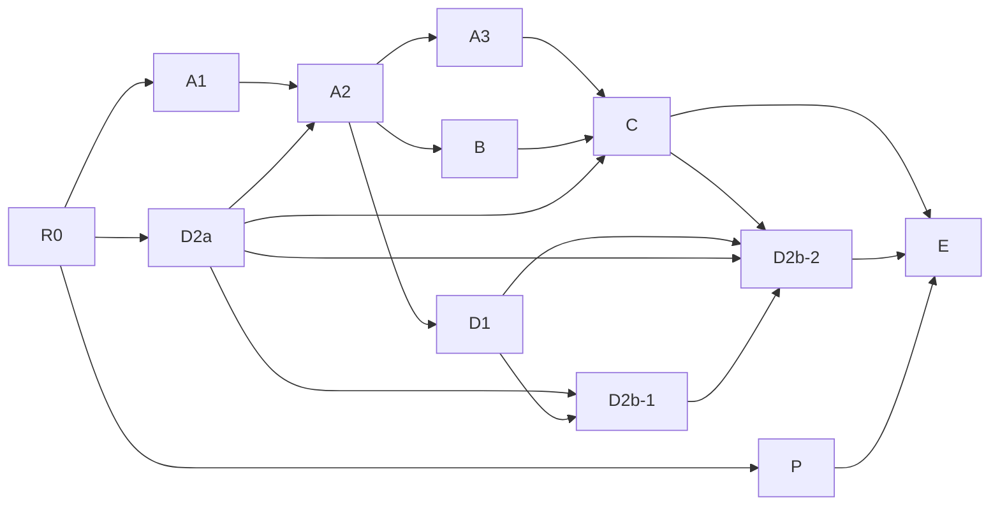

# NIR-1 L6〜L9 実行計画

更新日: 2026-09-17

基点: master@9f6aba5f
Tree: b7f97fc7dbbb5243da090b41dbc884ecfdc0ec2b

状態: 2026-09-17現在、#596/#597 foundations、#598 A3 review remediation、#599 typed Packing review remediationがmasterにある。Graph、Packing、AI dispatchは未activateで、Bはcapacity-remediation-in-progressである。proposal/5の契約は確認済みだが、supported capacityの数値、whole-project build、B activationは未完了である。downstream threat modelはdraft、NIR-1全体のruntime integration・activation・受入れは未完了である。#591のA2限定完了とR0台帳は履歴として保持する。

2026-09-22実装追記: #600/#601の共有lifecycle実装はmasterへマージ済みで、`master@6217e0155f53c9f8d267ed3c17e3952bc2f8f986`（Tree `959f57102e93099872cffd07ea6970e83b7952c9`）以降の残工程は [NIR-1 残工程実装計画](nir1-post-b-execution-plan.md) が所有する。B-close第1段階の19-path / 114-child-run容量診断は完走したが、[診断記録](nir1-b-close-capacity-observation-2026-09-22.md) に残す未測定項目と数値契約の明示確認があるため、Bは引き続きcapacity-remediation-in-progressである。Graph、Packing、AI dispatchは未activateのままである。

## 概要

本書は、L0〜L5を引き継いでL6〜L9を実装するための実行契約である。統合計画の履歴的な設計・受入れ記録を置き換えず、実装順序、公開前提、境界、評価、完了判定を具体化する。

初期版の強い送信境界は、制限成立後、同一Electron profile内の全作品・全会話を継続的なlocal-only領域にする。NIR非対応の通常会話も例外にしない。通常操作による解除や、外部利用と併存する分離profileは初期版に含めない。reload、workspace切替、別窓、再起動後も制限を維持する。

## PR-R0 — 履歴台帳と評価契約の固定

この節の台帳、開始判定、ready状態は2026-09-13時点のR0記録であり、2026-09-16の現在スナップショットにあるA2限定完了を上書きしない。

R0は、#572の現在地、後続laneの境界、契約ごとの開始可否、評価条件をこの実行計画に固定する文書・品質契約の変更である。runtime、policy、activation、既存のL0〜L5評価fixtureは変更しない。確認基点は最新 `origin/master` の #572であり、下表のrefは実装・履歴の存在または記録した明示確認の範囲だけを示し、確認済みtyped /4のscopeを越えて新しいruntime／consumer資格を有効化したことを示さない。

| 項目 | R0で記録する値 |
| ---- | -------------- |
| requestedBase / resolvedBase | `master@68516b033f395f24f98c502c9fd2a715d7aec2af` / 同じ #572 を含む `origin/master` |
| Tree | `04c491c29627ecc840112ebe379a5363e16892ff` |
| candidateBranch | `codex/nir1-r0-contract-ledger` |
| plan / policy / threat refs | 本書、統合計画、ロードマップ、既存 quality manifest / impact map。下流 threat model は draft のまま |
| receipt boundary | 初回static draftの旧R0候補のfocused test／`verify:quality`／Quick＋verifyは無効。今後の実装候補は全PR共通 merge gate M（clean candidateのFull＋直後verify）で判定し、旧receiptを流用しない |

### #572の実装済み／未完了

| #572で確認できる実装 | 未完了・R0で公開しないもの |
| -------------------- | ----------------------------- |
| typed Scope / Entity / Relation / Evidence validation、Native所有のimmutable Revision保存と承認済みRevision reader | RevisionのSource Basis / Dependency / Generic Freshnessによるcanonical資格、全材料closure |
| request-local Graph primitive、Raw必須・非Raw atomic groupを扱うPacking primitive | canonical Graph Index、全Scope軸の開示、ContextPlan／dispatch／履歴への製品統合 |
| typed createとPacking helper、および境界の拒否を検証する既存契約 | 通常操作でのreview公開、D2a profile制限、D2b receipt／履歴再認可、L9 journey |
| typed writerのreconciliation envelope（現状NULLを含む）を保存 | NULL envelopeを後から適格化すること、#572のcatalog読取をGraph Indexへ昇格すること |

### writer・caller・plaintext・egress影響台帳

| ledgerId | writer / caller / 入口 | 現在の扱い | R0の判定 |
| -------- | ------------------------ | ---------- | --------- |
| `source-tree-scope` | 本文、tree、Scope registry、scene設定、incarnation | 正本authorityを再利用。設定・本文・復元は旧資格を失効させる対象 | A1/A3/B/D1で詳細ref確認まで未開始 |
| `proposal-revision` | typed Revision、Human Decision、Evidence、Dependency / Freshness | #572のwriterは保存まで。NULL envelopeは利用資格を証明しない | A2/B/C/D1で材料契約を閉じるまで未開始 |
| `human-decision` | review、承認、取消、差替え、import / undo / restore | currentかつ明示承認を独立軸として維持 | A2/B/Cで同一transactionの失効を確認するまで未開始 |
| `index-generation` | Chronicle / Graph build、publish、rebuild、sealed generation | Graphは独立Indexと限定bindingが必要。別authorityを作らない | B/Cでregistry・Freshness・D1 headを確認するまで未開始 |
| `renderer-typed-ipc` | renderer → preload / main → Native | renderer申告を認可根拠にしない。新IPCのactivationはR0で行わない | D2a/D2bがcaller epochとhandleを固定するまで未開始 |
| `ai-senders` | chat stream / single-shot / CLI / Codex App Server / background | local設定を含む旧経路をD2a後は拒否。停止経路を利用可能とは数えない | D2aのprofile-wide gateまで未開始 |
| `review-db-audit-event` | review表示、汎用DB、保存会話・audit、event配信 | 制限対象plaintextの全入口。未分類出口は許可しない | D2a後の公開条件を満たすまで未開始 |
| `mcp-generic-http-connection` | MCP / HTTP / proxy / redirect / 接続テスト | 新規外部送信や既存localの例外を作らない | D2a/D2b-1の拒否とlocal transport確認まで未開始 |

台帳にない出力入口を「通常機能」と推定して許可しない。R0では既存コードを変更せず、writerの境界とcaller／plaintext／egressの分類だけを固定する。

### profile状態遷移（計画上の開始条件）

| state | 意味 | 次へ進む条件 | R0時点 |
| ----- | ---- | ------------ | ------- |
| S0 | 既存L5と#572のtyped基盤runtime。NIR-1 L6〜L9のproduction runtime integration／activationなし | R0台帳が固定される | 現在地 |
| S1 | A1保存・incarnationと既存L5移行ガードの候補 | Scope authorityの詳細refとA1 focused受入れ | blocked |
| S2 | D2a profile-wide local-only制限の成立処理中 | 全旧caller・入口拒否、永続化、起動時gate | blocked |
| S3 | D2a成立後、D2b-2/P3前 | 旧localを含む旧送信拒否を維持し、新しい送信は公開しない | blocked |
| S4 | D2b-2/P3統合後の対応済みlocal経路だけ | handle、receipt、履歴再認可、最終requestの独立受入れ | blocked |

R0の `ready` は文書・評価契約を次のlaneへ引き渡せるという意味に限る。S1〜S4のruntime開始・activationを許可する意味ではない。

### 契約別の確認台帳

`draftRef` はレビュー対象の提案版、`confirmedRef` は明示確認済みの批准refであり、同じ値や提案の存在を確認と読み替えない。四つのproposal/3行は確認済みbaselineとして保持し、typed Revisionの `nir1-l6-l9-contract-proposal/4` Option B rowと、容量境界のmaterial deltaを含む `nir1-l6-l9-contract-proposal/5` `graph-limited-binding` rowも、ユーザーのexact statementにより `draftRef#contractId` の形式で明示確認済みとして記録する。proposal/5の確認は三つのresource unit、whole-project lifecycle、測定／受入れ分離を契約化するが、supported capacityの数値やruntime／consumer activationを許可しない。confirmed行もR0 mergeと通常依存、capacity remediationの受入れを満たすまでlaneを完了へ進めない。

| contractId | draftRef | confirmedRef | confirmedScope | remainingDelta | affectedLanes | startStatus | blockedReason | unblockingEvidence |
| ---------- | -------- | ------------ | -------------- | -------------- | ------------- | ----------- | ------------- | ------------------ |
| `scope-storage-authority` | `nir1-l6-l9-contract-proposal/3` | `nir1-l6-l9-contract-proposal/3#scope-storage-authority` | proposal/3 scope only: L0〜L5の `nir1-product-tm/1` と既存Scope vocabulary＋記載したL6〜L9保存delta | none — proposal/3 confirmed; implementation／acceptance remains dependency-gated | A1、A2、A3、B、D1 | ready-after-R0-merge | none — explicit user confirmation recorded; R0 merge／normal dependencies still gate start | `confirmedRef=nir1-l6-l9-contract-proposal/3#scope-storage-authority`; exact row only; start after R0 merge／normal dependencies |
| `caller-profile-egress` | `nir1-l6-l9-contract-proposal/3` | `nir1-l6-l9-contract-proposal/3#caller-profile-egress` | proposal/3 scope only: L0〜L5の `nir1-product-tm/1` boundary＋記載したL6〜L9 egress delta | none — proposal/3 confirmed; implementation／acceptance remains dependency-gated | D2a、A2、C、D2b | ready-after-R0-merge | none — explicit user confirmation recorded; R0 merge／normal dependencies still gate start | `confirmedRef=nir1-l6-l9-contract-proposal/3#caller-profile-egress`; exact row only; start after R0 merge／normal dependencies |
| `typed-revision-material` | `nir1-l6-l9-contract-proposal/4` | `nir1-l6-l9-contract-proposal/4#typed-revision-material` | proposal/4 scope only: Option B independent Entity／Relation-only assertion family `nir1.entity-relation@1`、L0〜L5の `nir1-product-tm/1`＋既存Revision/Freshness vocabularyと記載したdelta。generic consumer／authorityへの拡張なし | none — proposal/4 Option B is explicitly ratified and effective; implementation／acceptance remains dependency-gated | A2、A3、B、C、D1 | ready-after-R0-merge | none — exact user confirmation is recorded; A1／D2a／normal dependencies still gate implementation／acceptance | `confirmedRef=nir1-l6-l9-contract-proposal/4#typed-revision-material`; exact statement: "I confirm draftRef nir1-l6-l9-contract-proposal/4 for contractId typed-revision-material."; this independently ratifies only this row |
| `graph-limited-binding` | `nir1-l6-l9-contract-proposal/5` | `nir1-l6-l9-contract-proposal/5#graph-limited-binding` | proposal/5 confirmed scope: proposal/3のGraph binding／query protectionsを保持し、三つのresource unit、whole-project build lifecycle、measurement／acceptance split、finalized P2 boundariesを加える。L0〜L5の `nir1-product-tm/1` scope、既存dependency／Source／D1 authorityは変更しない | none — proposal/5 is explicitly confirmed; capacity remediation／implementation／acceptance remains dependency-gated, and no supported capacity number or product activation is ratified | B、C | capacity-remediation-in-progress | exact confirmation is recorded; B/C remain blocked on measurement, semantic gates, normal dependencies, and product activation | `confirmedRef=nir1-l6-l9-contract-proposal/5#graph-limited-binding`; exact statement: `I confirm draftRef nir1-l6-l9-contract-proposal/5 for contractId graph-limited-binding.` |
| `native-generation-receipt` | `nir1-l6-l9-contract-proposal/3` | `nir1-l6-l9-contract-proposal/3#native-generation-receipt` | proposal/3 scope only: L0〜L5の `nir1-product-tm/1` boundary＋記載したreceipt delta | none — proposal/3 confirmed; implementation／acceptance remains dependency-gated | D2b-1、D2b-2 | ready-after-R0-merge | none — explicit user confirmation recorded; R0 merge／normal dependencies still gate start | `confirmedRef=nir1-l6-l9-contract-proposal/3#native-generation-receipt`; exact row only; start after R0 merge／normal dependencies |
| `history-reauthorization` | `nir1-l6-l9-contract-proposal/3` | `nir1-l6-l9-contract-proposal/3#history-reauthorization` | proposal/3 scope only: L0〜L5の `nir1-product-tm/1`＋既存Scope／Revision vocabularyと記載したlineage delta | none — proposal/3 confirmed; implementation／acceptance remains dependency-gated | D2b-2、E | ready-after-R0-merge | none — explicit user confirmation recorded; R0 merge／normal dependencies still gate start | `confirmedRef=nir1-l6-l9-contract-proposal/3#history-reauthorization`; exact row only; start after R0 merge／normal dependencies |

### R0 security contract proposal (draft)

`draftRef`: R0でmerge済みのproposal/3五つのcontract rowと、PR #579で記録したOption Bのtyped rowは、それぞれのscopeだけを記録する。typed rowはexact user confirmationにより明示批准済み・契約として有効である。`graph-limited-binding` のproposal/5も、既存proposal/3の確認済みscopeを置き換えず、容量境界のmaterial deltaとして同じexact user confirmationにより明示確認済み・契約として有効である。これはレビューとユーザー確認のためのboundedな提案であり、新しいauthority、保存表、IPC、policy、runtime、consumer、activationを追加しない。L0〜L5の `nir1-product-tm/1` の範囲は変更しない。六つ目のrowは各contractIdのscopeだけを確認し、downstream threat modelはdraftのままとする。trusted／untrusted actor、攻撃範囲、防御、保存・保持、データ分類、endpoint、acceptance conditionのmaterial changeは再確認を要する。以下の「確認後に開くlane」は実装着手を意味せず、runtime／consumer activationは別途未完了のままとする。

Confirmation protocol (recorded, bounded): only an explicit user statement naming the exact `draftRef` and one `contractId` confirms that one row; the stable ledger form is `draftRef#contractId`. The four `nir1-l6-l9-contract-proposal/3#<contractId>` refs in the ledger record separate confirmations for exactly `scope-storage-authority`, `caller-profile-egress`, `native-generation-receipt`, and `history-reauthorization`; they confirm proposal/3 scope only. The user-selected Option B family is concrete and independently ratified for `typed-revision-material` by the exact statement: “I confirm draftRef nir1-l6-l9-contract-proposal/4 for contractId typed-revision-material.” The proposal/5 graph capacity delta requires the separate exact statement, which is recorded here: `I confirm draftRef nir1-l6-l9-contract-proposal/5 for contractId graph-limited-binding.` That statement confirms the proposal/5 material delta while preserving the proposal/3 Graph protections. Plan agreement, an active goal, a merge instruction, or broad wording such as “this proposal is fine” is not a ratification. Confirming one row does not confirm its dependencies. The confirmation is limited to the Entity／Relation-only family and never widens to a generic consumer／authority, activates runtime, grants secret privilege, or permits external send.

#### scope-storage-authority

- Baseline (approved; limited): accepted ADR009 はScope／Relation vocabularyと既存のproject Scope authorityだけ、`nir1-plan/1` と `nir1-product-tm/1` はL0〜L5だけを承認済みとする。L6〜L9の保存・移行は未承認。
- Delta (L6-L9 data / shape / ownership / lifecycle): Native-owned project registryとsceneごとのclosed bindingに、既存 `ScopeBinding` の `reading`／`story`／`auto`／`phase`／`reveal`／`pov`／`authorityRevision` を使い、ADR009の `timeline`／`worldline`／`narrativeLayer`／`knowledgeHolder`／`audience` を対応づける。query identityとmaterial disclosure constraintも同じbindingに含める。`sceneIncarnationId` はNative-ownedのscene生存世代IDであり、`legacy-absent | explicit | unknown` は別フィールドのScope marker（incarnation IDではない）とする（本文やfull closureを複製しない）。既存sceneの移行はlegacy markerに限定し、通常編集は同じ `sceneIncarnationId` を継続し、Source tokenを更新して旧Revision／Index／query／result／Evidence eligibilityをinvalidateする。明示設定変更は同じ `sceneIncarnationId` を継続し、Scope markerを`explicit`に設定し、関連するSource tokenを更新して旧eligibilityをinvalidateする一方、新規、duplicate、import、削除後のID再利用だけが新しい `sceneIncarnationId` を発行し、`unknown` は未設定／unresolvedのScope markerに限り、新しいIDの代替にはしない（移行時の初回発行を除く）。clear／undoは旧資格へ戻さず、journal-proven restoreだけを対象にする。registry／setting／incarnation mutationは同一transactionで依存Revision／Index／query／result／Evidenceをinvalidateする。authorityは既存project Scope authorityを再利用し、第二のauthorityを作らない。
- Trusted actors: Native backend、既存project Scope authority、同一transactionのjournal／invalidation。
- Untrusted actors: rendererのScope／profile／incarnation申告、model output、stale UI／cache／restore-derived data。
- In-scope attacks: cross-project binding、偽造・stale authority token、unknownからanyへのfallback、ID reuse／restore混入、mutation後のstale result／Evidence／cache。
- Out-of-scope attacks: OS／backend／admin takeover、authorのsecret privilege、Raw search security redesign、external send。
- Mandatory defenses: Nativeが同一snapshotでauthorityとclosed typed fieldsを検証し、exact project／refを要求する。rendererを認可根拠にせず、unknown／unresolvedはfail closedにする。authority tokenをquery／material／Index／D1／publish／return／click／historyへ渡し、mutationとinvalidationを同一transactionにする。
- Acceptance implications: Positive: legacy移行の限定互換、explicit save／cold reopen、通常編集のincarnation continuity。Negative: cross-project、stale／unknown、ID reuse、future、偽造refを拒否する。Recovery: rollback後に旧generationを残さず、Native authorityから再buildし、unknown restoreをunavailableにする。Lane unlocked if confirmed: A1（依存するA2／A3／B／D1は各契約確認後のみ）。

#### caller-profile-egress

- Baseline (approved; limited): `nir1-plan/1` と `nir1-product-tm/1` のL0〜L5製品boundaryだけを承認済みとし、L6〜L9 profile-wide egress approvalはない。
- Delta (L6-L9 data / shape / ownership / lifecycle): Electron mainが発行するcaller identityをprofile／workspace／session／caller epochへbindし、Native-owned profile-wide local-only gateとpersistent stateを持つ。chat stream／single-shot、CLI／Codex App Server／background、HTTP／MCP／proxy／redirect／connection-test、DB／review／eventのplaintextを一つの分類ledgerで列挙する。startup gateはworkspace／renderer／event dispatchより先に評価し、D2aで旧external／旧local pathを閉じ、in-flight handleをinvalidateする。確認後もprovider名だけでは解除せず、D2b-2は別の明示確認があるまで新transportを公開しない。
- Trusted actors: Electron main sender、Native policy gate、profile state store、current workspace authority。
- Untrusted actors: rendererのsession／owner／route／category、stale handle、model／provider output、env／config／proxy／redirect。
- In-scope attacks: forged caller／project／session、cross-window／workspace／session、旧local／external fallback、proxy／redirect、retry replay、startup race、DB／review／event／CLI／background plaintext leak。
- Out-of-scope attacks: OS／main／backend compromise、admin reseal、model quality、secret privilege、既存Raw redesign、networkを使わないlocal processing。
- Mandatory defenses: main-issued identity、profile-wide deny-by-default、unknown／unclassified egressのdeny、plaintext dispatch前の停止とactive handle invalidation、startup ordering／persistent state／restart testを必須にする。将来のlocal transportもexact endpoint、proxy／redirect禁止、独立handle確認を要し、exception／unlockを作らない。external sendは行わない。
- Acceptance implications: Positive: reload／workspace切替／別窓／restart後もgateが維持され、非model Native saveが継続すること。Negative: 偽造、未分類、local名だけ、proxy pathがdispatch zeroになること。Recovery: failure／partial stop後もplaintext denyと旧handle拒否を保つこと。Lane unlocked if confirmed: D2aのみ（A2／C／D2bは各行の確認が必要）。

#### typed-revision-material

- Baseline (approved; limited): #572で実装済みの `ADR011` immutable proposal-revision semantics、`ADR010` Material Basis／Dependency／Context vocabulary、既存 `narrative-consumer-contract` の `narrative_proposal_revisions.id` とcanonical `narrative_consumer_freshness` だけを再利用する。`nir1-product-tm/1` はL0〜L5だけを承認済みとし、`narrative-ir-revision` は既存policyでnot-yet-modelledのままにする。
- Delta (L6-L9 data / shape / ownership / lifecycle): User-selected Option B defines the independent Entity／Relation assertion family `nir1.entity-relation@1`; it is not a mapping to policy family `scene-event@1`. The only supported payload is #572 `EntityRelationBundle { projectId, revisionId, producer, entities[{ entityId, entityType, label, sourceToken, scope{ reading, story, auto, phase, reveal, pov, authorityRevision }, evidence[{ evidenceId, sourceRef, quote, startUtf16, endUtf16 }] }], relations[{ edgeId, fromEntityId, toEntityId, relationType, directionality, sourceToken, evidenceIds }] }`. Native writer owns UUID `revisionId` and payload digest, validates same-project visible `codex_entries`／`codex_relations`, summary／name-derived UTF-16 Evidence, and current Scope token, then stores the immutable payload in existing `narrative_proposal_revisions`; current reader requires exact current revision and the existing `approved`／`human`／`electron:human-review` decision. The existing `narrative_proposal_decisions` ledger remains separate. Existing Envelope V2 references `effectiveMaterialBasis.sourceBasis`／`evidenceSet`／`dependencySet` (with digests) and `revisionBasis.contextSet`／`derivationContextSet` are used where populated; `reconciliation_envelope` NULL never qualifies. The canonical `narrative_consumer_freshness` row remains the sole Freshness authority for the proposal-revision key. Store full transitive dependency IDs／digests and Evidence／basis references only; do not copy full closure bodies or add an assertion table, Consumer, or authority. Source／edge／Freshness mutation invalidates the immutable revision in the same transaction; an old NULL row is never retrofitted.
- Supported material boundary / smallest remaining decision: Option B is concrete and independently ratified by the recorded user confirmation: same-project visible Codex entities／relations and their summary／name Evidence only, with no scene／Chronicle／artifact／import／author-declared material and no inferred full closure. The family choice is resolved as `nir1.entity-relation@1`; PR #579 records the exact `/4` row as effective. Implementation and acceptance remain gated by A1／D2a and the normal lane dependencies.
- Trusted actors: Native typed writer／reader、existing `narrative_proposal_revisions` row、existing `narrative_proposal_decisions` ledger、registered Source／D1、canonical `narrative_consumer_freshness`。
- Untrusted actors: renderer bundle／ID／digest／Scope、model output、mutable catalog／cache／Graph／Index、stale IPC、client-supplied family claims。
- In-scope attacks: forged ID／token／digest、cross-project／revision、stale／deleted Source／Evidence、missing／partial transitive dependencies、NULL-envelope promotion、`scene-event@1` remapping、unsupported familyのGraph／Packing流入、freshness self-claim、second Freshness／Consumer／authority、duplicate full-closure storage。
- Out-of-scope attacks: semantic truth／model quality、future `scene-event@1` mapping or another family approval、full closure storage／export、external send、secret privilege、Graph／Index activation。
- Mandatory defenses: current exact `EntityRelationBundle` validators (including deny-unknown-fields)、Native UUID／UTF-16／live-source checks、allowlist `nir1.entity-relation@1` only、same-project visible entity／relation and Evidence binding、existing proposal／revision／decision authorities、complete existing Envelope V2 basis／context／dependency／Source refs with Native-owned digest, full transitive dependency IDs／digests without closure-body copies, and canonical `narrative_consumer_freshness`; unknown／unavailable fails closed, source／edge／Freshness publication and invalidation share one transaction, direct DML／old-row rewrite／new authority are forbidden, and the bundle cannot be interpreted as `scene-event@1` without a future separately ratified contract.
- Acceptance implications: Positive: exact `nir1.entity-relation@1` bundle shape, same-project live Sources, UTF-16 Evidence, current immutable Revision, explicit existing Human Decision, complete existing basis／dependency refs, canonical Freshness, and stable cold-reopen result with no second authority or full-closure copy. Negative: reject `scene-event@1` remapping, unsupported family/material, cross-project／revision, stale／deleted Source／Evidence, missing／partial transitive dependencies, forged token／digest, NULL envelope, duplicate closure body, or unqualified Graph／Packing; implementation and acceptance remain gated by A1／D2a and the normal lane dependencies. Recovery: any Source／edge／basis／decision mutation makes the prior row stale, requires a new immutable Revision plus new Human Decision and canonical Freshness evaluation, and rollback／restore never auto-qualifies it; failure returns display-only. Lane unlocked after normal dependencies: A2 is only ready after A1＋D2a; A3／B／C／D1 remain blocked until their normal dependencies and typed material qualification are complete. Required confirmation evidence is the exact statement: “I confirm draftRef nir1-l6-l9-contract-proposal/4 for contractId typed-revision-material.”

#### graph-limited-binding

- Baseline (approved; limited): accepted ADR010 のDependency／Context vocabulary、`narrative-consumer-contract` の宣言済みconsumer binding、およびproposal/3の `graph-limited-binding` confirmed scopeだけを承認済みとし、`nir1-product-tm/1` はL0〜L5に限る。NIR-1 Graph producer／Indexのruntime activation、whole-project build capacityの数値、製品query activationは未承認のままにする。
- Delta (L6-L9 data / shape / ownership / lifecycle; proposal/5 confirmed): 既存の `nir1-reviewed-entity-relation-v1` producer、`nir1-reviewed-entity-relation:v1` index key、`nir1-entity-relation-eligibility-set` source kindをtupleとして再利用する。既存proposal/3の確認済みGraph bindingと、queryの既存保護はbaselineとして保持する。新しいauthority、schema、consumer、persistent adjacencyは追加しない。容量境界は三つのresource unitへ分離する。(1) 一つの Entity／Relation Revision bundleは、現行の `512 records`／`2 MiB` validation contractを保持する。(2) 一つのseed-local Graph queryは、read／admission `512`、batch `16x32`、SQL `100,000 VM steps`（cancellation every `1,000` steps）、`2 MiB`、Graph `8ms`、reader／busy wait `0`を保持する。(3) whole-project B Index buildは、現在の全候補をenumerateし、qualified materialを全件atomic publishする。複数の individually valid Revisions にまたがる合計 qualified material record countは `entities.len + relations.len + material_basis.evidence_set.len` とし、各 Entity／Relation／Evidence entryを各1件として数えるため、Entity-only bundleもvalidとする。exact complete rosterはEntity／Relation／Evidenceの各recordを全件含み、missing／duplicateなしとする。Revision-ID overheadはmaterial record bytesとは別に測定・accountする。queryの合計値はbuildのcandidate count、compact roster count、cumulative bytes、cumulative SQLをcapしない。buildのsupported capacityは未測定であり、数値をこのconfirmed contractで批准しない。Derived IndexはNative／DBがrebuildし、sealed D1 head、既存registryのgeneration／source digest／dependency digest／dirty stateだけをbinding metadataにする。buildはsmall／keyset pagesを使い、一度に一つのA2 Revisionをqualificationする。各rowはallocation前にsizeを検査し、JSON／material processing中にもcancellationを確認する。publish直前にexact complete roster、Source、D1を再検証し、failure／cancel／driftではpartial generationを残さず、qualified material全件だけをatomic publishする。request-local catalog readerをcanonical Indexへ昇格させない。
- Trusted actors: Native／DB builder、既存producer／source registry、A1／A2のauthority、sealed D1 head。
- Untrusted actors: renderer query／seed、catalog／Graph cache、model output、stale generation／dependency digest、index restore。
- In-scope attacks: cross-project／wrong seed、unbounded hop／node／edge、stale or mixed generation、unqualified／missing-Evidence edge、dirty Index publish、request-local readerのauthority昇格、partial Graph fallback、resource exhaustion via oversized rowをallocation前に拒否しない経路、JSON／material processing中のcancellation bypass、SQL-step／cancellation bypass、reader／busy contention、resource-threshold drift from admission `512`, batch `16x32`, SQL `100,000 VM steps`, cancellation every `1,000` steps, Graph `8ms`, reader／busy wait `0`、build candidate／roster truncation、cumulative byte／SQL confusion、source／decision／scope drift at a build barrier、partial generation visibility、cancelled build-stateのrestart replay。
- Out-of-scope attacks: OS／backend compromise、semantic quality、Raw search redesign、external send、new producer or new material family。
- Mandatory defenses: explicit seed／project binding、bounded output、current A1／A2／Freshness／D1 tuple、atomic sealed publish／invalidate、dirty／unknown／digest mismatchはwhole-Graph unavailable、no mixed generation／partial Graph、Evidence path保持、rendererをauthorityにしない。Query resource guards remain fixed at read／admission `512`, batch `16x32`, SQL `100,000 VM steps`, cancellation every `1,000` steps, `2 MiB`, Graph `8ms`, reader／busy wait `0`; reject oversized rows before allocation (allocation前) and check cancellation during JSON／material processing (JSON／material processing中). Build must enumerate the complete current roster in small／keyset pages, qualify one A2 Revision at a time, and count qualified material records as `entities.len + relations.len + material_basis.evidence_set.len`, with each Entity／Relation／Evidence entry counted as one record and Entity-only bundles remaining valid. The exact complete roster must contain every Entity／Relation／Evidence record with no missing and no duplicates; Revision-ID overhead is measured and accounted separately. Revalidate the exact complete roster／Source／D1 at the publish barrier, and publish no partial generation. Paging bounds only page working set; it does not bound the compact full roster or the publish-time complete rescan. No cumulative build SQL cap is ratified. Every prepare／page／publish complete-rescan statement is owned by the builder's connection-level progress hook, which observes cancellation at a bounded `1,000` VM-step cadence and at Rust boundaries. On interruption／error／timeout／closed, statement termination／error must be observed, transaction rollback／close completed, the hook reset, and reader／handles／buffers released before retry／reentrant admission. A cancelled or failed build has no persisted restart state and starts fresh from the sealed generation. The first diagnostic stage measures build behavior before selecting supported work size／build memory／SQL／deadline values; no numeric build capacity or deadline is ratified before that measurement. Threshold changes require reconfirmation. This finite lifecycle uses existing connection／transaction primitives and creates no new framework.

The final-publication commit cutoff is separate from run creation and intermediate report commits: begin／run-record commits do not close cancellation. A work remains cancellable until `FinalizeGranted` is established by the final Graph generation publish commit or the final Verify／Rebuild success transaction; timeout, closed, workspace-generation change, and foreground preemption are ordered with cancellation at the same barrier. Once finalization permission wins, the commit result is collected to terminal state and a late cancel cannot rewrite success; completed earlier work remains published when a later work is cancelled.

Connection acquisition uses a background no-wait try-lock. After acquisition, continuous shared-connection occupation is measured separately from wait-to-acquire; a foreground request arriving during a long Rust phase is observed at the next page／row／A2／D1-edge／digest／serialization boundary, and the owner ends the transaction and releases the connection before retrying from a fresh snapshot. The transaction is never kept open while only the shared mutex is released. Rust loops, including D1／edge matching, roster sorting, digest generation, serialization, and result assembly, observe the same stop condition without waiting for another SQL statement.

Cleanup failure is terminal for reuse: reader／statement close, transaction rollback／commit plus `is_autocommit`, progress-hook removal, and busy-timeout restoration are checked before `connectionReusable=true`. A rollback, hook-removal, autocommit, or setting-restore failure records both the work error and cleanup error, marks the process-local connection `unusable`, performs no retry on that connection, and hands recovery to the existing workspace reopen path. SQLite auto-rollback is accepted only after autocommit is explicitly confirmed.
- Outside-initial-build full-set validation: Source re-resolution、is_complete_registered／complete registration／coverage verification、restore／cold reopen、およびfull validationを要求し得る将来のseed-local query admissionは、各既存Native／DB maintenance entryのowner、caller connection／read transaction、connection-level progress hookのbuild-resource contractに束縛する。nested resolverはouter owner／hookを継承し、hookをinstall／overwrite／resetせず、rollback／closeはouter ownerが実行しnested resolverはterminal statusをpropagateするだけとする。admission closure、actual statement termination／error evidence、rollback／close、hook reset、reader／handles／buffers release、retry／reentrant admission、bounded `1,000` VM-step cadence＋Rust boundaries、各full validation attemptのend-to-end measurementを要求する。cancel／timeout／closedはwhole attemptをterminateし、missing Source、per-edge diagnostic、successful verificationへcoerceしない。canonical seed-local queryがactiveでない間、queryはvalidation transactionへsynchronously入らず、Graph unavailable／contribution `0`とexisting R+IR／exact-R fallbackを返し、query budget／protectionsを維持する。current registrationをestablishできなければfail closed／unavailableとし、別の既存maintenance entryへowned validation／rebuildをrequest／performし、後続queryだけがcurrent sealed bindingを使う。unowned／unbounded whole-project scan、new framework、new authority、schema、consumer、persistent adjacencyを追加しない。
- Acceptance implications: Positive: qualified current seedからbounded pathとEvidenceが再build／cold reopen後も一致すること。Evidenceは`evidence_ref`、既存`source_key`／`revision_token`、親Revision／Decisionを束縛し、roster→D1／V1 dependency→Freshness→Verify→Restore→cold reopenを同じtyped identityで往復する。Negative: wrong／unknown seed、3 hop、limit超過、stale／dirty／unqualified edgeをGraph寄与0にし、read／admission `512`、batch `16x32`、SQL `100,000 VM steps`、cancellation every `1,000` steps、`2 MiB`、Graph `8ms`、reader／busy wait `0`を超えるquery入力・待機・閾値変更を拒否すること。oversized rowはallocation前に拒否し、JSON／material processing中のcancellationを無視しない。Buildのsemantic／capacity acceptanceは下表で分離し、supported capacityは測定後に選ぶ。Recovery: Indexを全停止してsealed headから再buildし、旧generationを混ぜずR+IRまたはexact Rへ戻すこと。Lane unlocked only after exact proposal/5 confirmation and A1／A2確認: B（CはさらにA3／D2aが必要）。

##### B build owner/lifecycle (proposal/5 confirmed contract)

| phase | statement / read transaction | runtime owner | cancel / hook | cleanup / rollback / restart |
| ----- | ---------------------------- | ------------- | ------------- | ---------------------------- |
| prepare | Native／DB builderがworkspace authority、runtime epoch、registry、Source、D1のbuild snapshotをcaller-ownedな単一read transactionでpinし、そのtransaction内でprepare statementを実行する。prepare statementはbuilderのconnection-level progress hookが所有し、cancellationをbounded `1,000` VM-step cadenceとRust boundaryで観測する | Native／DB builderがcompact roster、build snapshot、page bufferだけを所有する。persistent stagingは作らない | 最初のstatement前にhookを登録し、admissionとsnapshot不一致を拒否する。busy waitは`0`のままにする | interruption／error／timeout／closedではstatement termination／errorを観測し、transaction rollback／close、hook reset、reader／handles／buffers releaseを完了してからretry／reentrant admissionを開く。restartはsealed generationから新buildとして開始し、partial stateを再利用しない |
| page | pinした同一read transaction内で、小さいindexed keyset pageごとのstatementだけを開閉し、全candidate rosterを順序付きで列挙する。各page statementは同じbuilder connection-level progress hookの所有下で、cancellationをbounded `1,000` VM-step cadenceとRust boundaryで観測する。page間でtransaction／mutexを解放しない | 同じbuilderが一度に一つのA2 Revision qualification、compact roster、page bufferを所有する | 各page、各row、JSON／material処理の前後でhookを確認する。pending-start workは新statementを開始せず、admission closureを尊重する | page statement／bufferを解放するが、read transactionはbuildのterminalまで保持する。中断時はstatement terminationを確認してからsnapshot全体をrollback／closeし、cursorやpartial stateを再開に使わない |
| retry | page途中のretryは行わず、旧read transaction／snapshot全体を破棄して、先頭から新しいread transaction、cursor、A2 qualification attemptを開始する | builderだけが新buildのcompact roster／snapshot／page bufferを所有し、旧attemptのhandleを引き継がない | 新hookを登録し、旧hookと旧statementがterminal cleanup済みになるまでretry／reentrant admissionを閉じる | 旧statementのtermination／error、transaction rollback／close、hook reset、reader／handles／buffers releaseをこの順に完了してから再入場する。restartは完全な新buildとして先頭から再列挙する |
| cancel | cancel ownerはbuilderで、active page statementとcaller-owned read transactionをterminal cancellationへ遷移させる | builderがcancelled build stateの終端を記録する | JSON／material中を含むconnection-level progress hookを実際の終端まで保持し、bounded `1,000` VM-step cadenceとRust boundaryで確認する。pending-start workは開始しない | statement termination／errorを観測し、transaction rollback／close、hook reset、reader／handles／buffers releaseを完了してからretry／reentrant admissionを許可する。sealed old generationだけを残し、persisted restart stateは作らない |
| publish | page enumerationのread transactionをterminalに閉じた後、publish transaction内のexact complete roster、Source、D1、runtime epochのcomplete-rescan statementもbuilderのconnection-level progress hookが所有し、cancellationをbounded `1,000` VM-step cadenceとRust boundaryで観測する | 既存DB publish ownerとbuilderがatomic sealed generationを所有する | barrier前後のcancel／driftとadmission closureを拒否し、publish後にcancelを成功へ昇格させない。cumulative build SQL capは批准しない | interruption／error／timeout／closedならcomplete-rescan statementのtermination／error、publish transaction rollback／close、hook reset、reader／handles／buffers releaseを確認してpartial generationを可視化しない。成功時だけsealed headを更新する |
| source/coverage | 初回build外のSource re-resolutionとcomplete registration/coverage verificationを、各既存Native／DB maintenance entryのownerが所有するcaller connection／read transaction上でvalidation statementとして実行する。query-owned／unbounded scanは開始しない | maintenance ownerがfull-roster validationのcompact roster、dependency edges、validation outputs、handlesを所有する | ownerのconnection-level progress hookでbounded `1,000` VM-step cadenceとRust boundaryを観測し、admission closureを先に適用する。nested resolverはouter owner／connection hookを継承し、hookをoverwrite／resetしない | statement termination／error、transaction rollback／close、hook reset、reader／handles／buffers releaseを完了し、cancel／timeout／closedはwhole attemptを終了させる。cleanup後にretry／reentrant admissionを再開し、owned validation／rebuildを先頭から新attemptとして行う |
| reopen/query | canonical seed-local queryは現時点でactiveではない。将来のrestore／cold reopenと、full-roster verificationを要求し得るseed-local query admissionは、別の既存Native／DB maintenance entryへowned validation／rebuildをrequestし、queryはそのvalidation read transactionへsynchronously入らない。Search/queryはwhole-project scanをsynchronously実行しない | maintenance ownerがvalidation／rebuildのroster、Source／registration coverage、published readerを所有し、queryはcurrent registered sealed generationだけを読む。full validationが必要ならGraph unavailable／contribution `0`とし、existing R+IR／exact-R fallbackとquery budgetを維持する | maintenance ownerのconnection-level progress hookをbounded `1,000` VM-step cadenceとRust boundaryで使い、query admission closureとpending-start workを所有する。current registrationをestablishできなければqueryはfail closed／unavailableとし、別entryのowned validationを待つ | statement termination／error、rollback／close、hook reset、reader／handles／buffers releaseを観測してからretry／reentrant admissionを開く。cancel／timeout／closedはwhole attemptを終了させ、途中query／snapshot／persisted restart state／旧handlesを再利用しない。後続queryだけが新しいcurrent sealed bindingを使う |

##### Outside-initial-build full-roster validation (proposal/5 confirmed contract)

初回enumeration／qualification以外のwhole-project／full-roster verificationとfull-set maintenance validationも、同じbuild-resource／lifecycle contractに属する。各既存Native／DB maintenance entryがcaller connection、read transaction、progress hook、ownerを持ち、各full validation attemptをend-to-endでmeasurementする。
- Source re-resolution: maintenance entryのowner／caller connection／read transaction／progress hookでcurrent Sourceを再解決し、unowned／unbounded full-roster scanを開始しない。
- complete registration/coverage verification (`is_complete_registered`): 同じowned validation attemptで全件registration／coverageを検証し、unowned／unbounded full-roster scanを開始しない。
- restore/cold reopen verification: 同じowned validation attemptでsealed generation、Source、D1、complete rosterを再検証し、unowned／unbounded full-roster scanを開始しない。
- future seed-local query admission: canonical seed-local queryはactiveではなく、queryはvalidation read transactionへsynchronously入らない。full validationが必要ならGraph unavailable／contribution `0`とexisting R+IR／exact-R fallback、query budget／protectionsを返し、別の既存Native／DB maintenance entryへowned validation／rebuildをrequestする。後続queryだけがcurrent sealed bindingを使う。
- Common cancellation／cleanup: ownerはadmission closure、actual statement termination／error evidence、transaction rollback／close、hook reset、reader／handles／buffers release、retry／reentrant admissionを束ねる。同じbounded `1,000` VM-step cadenceとRust boundariesを使い、nested resolverはouter owner／connection hookを継承してhookをinstall／overwrite／resetせず、rollback／closeはouter ownerが実行しnested resolverはterminal statusをpropagateするだけとする。cancel／timeout／closedはper-edge missing／diagnosticやsuccessful verificationへcoerceせずwhole attemptをterminateする。queryはunowned／unbounded whole-project scanをsynchronously実行せず、query protections remain unchanged and no new framework is added。この経路は各full validation attemptをend-to-endでmeasurementする。

この表は有限のowner／lifecycle matrixであり、新しいframework、authority、schema、consumer、persistent adjacencyを作らない。各entry／start、retry／reentrant、admission closure、pending-start work、active handles、cancellation、bounded wait、actual terminal proof、error／timeout／onClosed ownership、persisted restartを明示する。prepare／page／publish complete-rescanの累積SQL上限はこのdraftで批准せず、supported work size／build memory／SQL／deadlineは第1診断stageの測定後に選ぶ。

| lifecycle case | entry／start | admission closure | pending-start work | active handles | cancellation／bounded wait | actual terminal proof | error／timeout／onClosed ownership | persisted restart |
| -------------- | ------------ | ----------------- | ----------------- | -------------- | ------------------------ | --------------------- | ------------------------------- | ----------------- |
| entry／start | builderがread transactionとconnection-level progress hookをpinしてからprepareを開始する | snapshot pinからterminal cleanupまで新規entryを閉じる | pending-start statementは開始せずcancel／closedとして終端する | builderがstatement、reader、transaction、handles、buffersを所有する | `1,000` VM-step cadenceとRust boundary、reader／busy wait `0` | statement termination／errorを観測し、terminal receiptを記録する | builderがerror／timeout／onClosedを観測し、rollback／closeとhook resetを所有する | restart stateは永続化せずsealed generationから新buildを開始する |
| retry／reentrant | retryは前回attemptの全snapshotを破棄した後だけentryする | cleanup完了までretry／reentrant admissionを閉じる | 旧pending workと旧cursorは捨て、新buildの先頭から開始する | 旧active handlesを引き継がず、新builder handlesだけを所有する | cancellationはbounded wait内にhookへ届き、busy waitは`0` | statementとtransactionの実終了を観測してから再入場する | error／timeout／onClosedの所有者はbuilderで、失敗をsuccessへ昇格しない | persisted restart stateなしでsealed generationから再列挙する |
| admission closure | cancel／error／timeout／closedでadmissionを閉じる | terminal cleanupが完了するまでclosureを解除しない | pending-start workを捨て、statementを新規開始しない | active statement、reader、handles、buffersの一覧をbuilderが保持する | progress hookとRust boundaryでbounded cancellationを観測する | termination／error、rollback／close、hook reset、releaseの完了を確認する | onClosedを含む全終了通知をbuilderが所有し、closed後の再利用を拒否する | incomplete stateを保存せずsealed generationだけを残す |
| cancellation | entry／start後の全phaseで同じhookを使う | cancellation中はadmission closureを維持する | pending-start workを開始せず、page途中のretryもしない | active handlesをterminal cleanupまでbuilderが保持する | `1,000` VM-step cadenceとRust boundaryでbounded waitし、busy waitは`0` | statement termination／errorの観測後にrollback／closeを完了する | builderがcancel／timeout／onClosedの最終状態を所有する | fresh buildはsealed generationからのみ開始する |
| error／timeout／onClosed | どのentry／start phaseでも同じ終了手順を適用する | 新規admissionを閉じて旧attemptを隔離する | pending-start workを破棄し、reentrant startを遅延する | statement、reader、transaction、handles、buffersをbuilderが解放する | hook reset後にのみbounded waitを終了する | 実際のstatement termination／errorとrollback／closeを確認する | builderがerror／timeout／onClosed ownershipとterminal proofを保持する | persisted restart stateを作らず、sealed generationから再開する |
| reopen | cold reopenはsealed generationのreaderだけからentryする | incomplete build stateはadmission不可とする | pending-start workは新buildへ引き継がない | published readerだけをactive handleとする | build hookを持ち越さずbusy waitは`0` | sealed generationの完全性とcurrent tupleを再検証する | reopen failureはbuilder／reader ownerがunavailableへ閉じる | 途中snapshotやpersisted restart stateから再開しない |

##### Proposal/5 acceptance split (confirmed contract)

Deterministic semantic gatesは測定したcapacityから独立させる。

| semantic gate | 判定 |
| ------------ | ---- |
| `>512` qualified material records across multiple individually valid Revisions | qualified material record countは `entities.len + relations.len + material_basis.evidence_set.len` とし、各 Entity／Relation／Evidence entryを各1件として数える。Entity-only bundleもvalidとし、`>512`件をexact complete rosterとして列挙する。rosterはEntity／Relation／Evidenceの全recordを含み、no missing／no duplicatesとする。Revision-ID overheadはrecord bytesと別に測定・accountし、queryの`512`をbuild rosterのcapにしない |
| `>512` unrelated/ineligible candidate Revisions | 無関係・未適格なcandidate Revisionを`>512`件混在させてもcandidate rosterを短絡せず、Source／Decision／Freshness／Scope不一致をqualificationから除外し、Entity／Relation／Evidenceのqualified material record全件のexact rosterを不変にする |
| exact roster invariance | 同一sealed inputのqualified material record rosterはEntity／Relation／Evidenceの各recordを全件・同一順序で含み、missing／duplicateなしに一致し、decoy除外、barrier再検証、cancel／retry後もrecord countとrosterを変えない |
| source／decision／scope drift at barriers | prepare、page、publish barrierの各driftで対象とdescendantを失効させ、exact complete roster／Source／D1再検証が通らなければpublishしない |
| cancellation recovery | prepare、page、retry、JSON／material、publishのcancelでpartial generationを公開せず、statement termination／errorを観測し、transaction rollback／close、hook reset、reader／handles／buffers releaseを完了してからretry／reentrant admissionを開き、cleanup後にcold reopen／restartしてsealed old generationまたはsafe fallbackを返す |
| cold reopen | 完成したsealed generationだけを再openし、roster／Source／D1 tupleとqualified materialの同一性を確認する。途中snapshot、incomplete build state、persisted restart stateからは再openしない |
| atomic visibility | readerは旧sealed generationまたは全件qualifiedの新sealed generationだけを観測し、partial／mixed generationを観測しない。publish transactionのrollback／closeとstatement terminal proofが揃うまで新generationを見せない |
| query independence | seed-local queryのread／admission `512`等の保護を維持し、whole-project buildのcandidate count、roster count、cumulative bytes、cumulative SQLをquery totalsでcapしない |

Capacity benchmark metricsは、compact full rosterとpublish-time complete rescanを含めて第1診断stageで測る記録であり、numeric build capacityの批准ではない。buildには`mandatory end-to-end peak memory for the full build-through-publish interval`（prepare／A2 qualificationからpublish＋cleanupまで）を必須とし、各full-set maintenance pathにも個別のend-to-end peak total memoryを要求する。roster bytesとRevision-ID overheadはcomponents onlyとして別に報告する。memory accountingはsnapshot roster＋dependency edges、A2 row／JSON／parsed bundle／material、rescan roster＋edges、digest／serialization、D1 prepared／digest／verification collections、edge observations／states、DB／statement／cache、container capacity／temp copiesをすべて含める。RSSが取得できない場合でも、全major structureの同時peakを`simultaneous high-water mark`または`documented conservative upper bound`としてaccountし、method／coverage／uncertaintyを記録する。unaccounted major structureがあればcapacity decisionをしてはならない。測定形状は材料数だけでなくRevision数、payload／envelope／live Source bytes、Evidence shared／unique、依存edge、ineligible候補、report-heavy失敗経路を変える。各warmup／measurement runは同じpreseed済みfile-backed DB copyとfresh subprocessから始め、warmupを既存Indexのrebuildと混ぜない。wall、CPU、SQL steps、read／write counts、temp、lock time、continuous connection occupation、publish occupation、foreground wait、cancel latency、cold reopen、seed-local queryも計測し、supported work size／build memory／SQL／deadlineはその結果から後で選ぶ。

Acceptance also includes the existing Full maintenance journeys that cover cancellation, dispose, and workspace changes; “Journey対象外” applies only to new Journey implementation and NIR-1 product activation. Requested and effective model／effort metadata are recorded independently for implementation, acceptance, and review; if effective metadata is unavailable, record `unavailable` and never infer it from requested values.

Required confirmation evidence is the exact statement: `I confirm draftRef nir1-l6-l9-contract-proposal/5 for contractId graph-limited-binding.`

#### native-generation-receipt

- Baseline (approved; limited): accepted ADR011 のstage modelとterminal receipt metadata、`nir1-product-tm/1` のL0〜L5 boundaryだけを承認済みとし、L6〜L9 Native receiptは未承認。
- Delta (L6-L9 data / shape / ownership / lifecycle): Native-owned immutable generation handleは `projectId`／profile／caller epoch、request／revision／material／Scope／D1 generation binding、opaque handle、creation／expiryを持つ。`queued | running` はnon-terminal execution stateであり、terminal receiptではない。provider terminal／parseStatus／responseDigestのterminal matrixは `succeeded + parsed + required`、`failed + invalid + required`、`failed + not-attempted + null`、`cancelled + not-attempted + null`、`skipped + not-attempted + null` の5通りに固定する。provider terminalをtransport観測値として記録し、message versionとparseStatusを必須metadataにする。receiptはraw body／thinkingを重複保存せず、既存body／artifactへの参照、domain-separatedなtext／thinking digest、`responseDigest`、transport class／endpoint identity（credential／raw URLなし）、`generationId`、request／revision／material digest、observedAt、failure／retry classificationだけを返す。transport-observed raw textとthinkingはdigest前に分離し、versioned stable chunk-order digestはchunk-boundary invariantかつorder-sensitiveで、trimもUnicode normalizationも行わない。本文／provider responseをreceiptに二重保存せず、既存body／artifact storeを正本にする。dispatch前にhandle／epoch／current tupleを再検証し、cancel／timeout／failure／restartで失効させ、retryは新handleと新receiptにする。provider terminalを受けたineligible／parse failure、provider terminalなしのEOF、length truncation、parse failureは `failed + invalid + required`、dispatch failureは `failed + not-attempted + null`、cancel pathは `cancelled + not-attempted + null`、skip pathは `skipped + not-attempted + null` として、それぞれexactly one terminal receiptをdurably persistする。これらはsuccessful generation qualification／publicationからのみrejectし、terminal receipt自体は発行する。
- Trusted actors: Native generation coordinator、existing body／artifact store、D2a profile gate、current Revision／Scope／D1 authorities。
- Untrusted actors: renderer request／handle／receipt、provider／model response、stale retry、proxy／transport metadata、restored UI state。
- In-scope attacks: handle／generation replay、cross-project／epoch、receipt forgery／partial success、secret／raw endpoint leakage、retry after cancellation、crash／restart mismatch、stale artifact display。
- Out-of-scope attacks: OS／backend compromise、model quality、external-send authorization、full provider transport redesign、secret privilege。
- Mandatory defenses: Native validation at create／dispatch／return, opaque non-authorizing handle, exact current tuple／expiry／epoch, no credential/raw URL or raw body／thinking duplicate in receipt, atomic durable terminal state with exactly one terminal receipt for every ineligible／EOF／length truncation／parse／dispatch／cancel／skip path, and rejection only from successful generation qualification／publication. Persist provider terminal (including absent), parseStatus、message version、responseDigest、domain-separated text／thinking digests and existing body／artifact refs; separate transport-observed raw text／thinking before hashing; keep the versioned stable chunk-order digest chunk-boundary invariant, order-sensitive, and free of trim／Unicode normalization. Idempotent cancellation without success promotion, retry isolation, return／click revalidation, failure-safe unavailable result。
- Acceptance implications: Positive: only `succeeded + parsed + required` with a valid provider terminal, coherent message version／digests, and the handle→terminal receipt→stored artifact same-generation binding qualifies for generation publication. Negative: forged／expired／cross-project handle、partial／secret-bearing receipt、text／thinking混結、chunk boundary/order or message-version mismatch、provider terminalなしのEOF、length truncation、parse／dispatch failure、cancel、skipをsuccessful qualification／publicationに使わず、各経路がexactly one `failed`／`cancelled`／`skipped` terminal receiptをmatrix通りにpersistすること。 Recovery: crash／restart後に未確定をfailed／unavailableとして一度だけterminal化し、旧handleを拒否すること。 Lane unlocked if confirmed: D2b-1（D2b-2はhistory再認可と最終requestの確認後）。

#### history-reauthorization

- Baseline (approved; limited): `ADR009` のScope／Relation、`ADR011` のproposal-revision semantics、`nir1-product-tm/1` のL0〜L5だけを再利用する。L6〜L9 lineage reauthorizationは未承認。
- Delta (L6-L9 data / shape / ownership / lifecycle): Native-owned reusable-history eligibilityは既存 message／session／artifact identifiersへの参照として `projectId`／revisionId／Envelope／material／Scope／D1 digests、parent artifact／generation receipt、`Source`／`Revision`／`Decision`／`Freshness`／`Index`、purpose、input-use、send classification、created／expiresを記録する。会話本文やfull closureを複製せず、turnごとにこのexact tupleとScope axes `readingOrder` (reading)／`storyTime` (story)／`viewpoint`／`knowledgeHolder` (knowledge-holder)／`audience`／`timeline`／`worldline`／`narrativeLayer` (layer)／`scene`を再認可する。full transitive dependency setを解決し、stale／unknown dependencyまたは不適格なdescendantがあればそのchildと全descendantを除外する。closed binding、material、decision、receiptが変わればchild eligibilityをinvalidateし、displayだけではNarrative Assertionを自動生成しない。restore／undoは旧eligibilityを復活させない。
- Trusted actors: Native history gate、existing message／artifact store、current Scope／Revision／Decision／Freshness／receipt authorities。
- Untrusted actors: renderer history selection／purpose、stale conversation／artifact cache、model output、restored／imported IDs、caller／session claims。
- In-scope attacks: cross-project／scene、stale approval／material／receipt、purpose／category escalation、ID reuse／restore replay、child lineage after `Source`／`Revision`／`Decision`／`Freshness`／`Index` or Scope-axis change、input-use／send classification escalation、omitted or partial full transitive dependency、descendant exclusion bypass、display-to-assertion confusion。
- Out-of-scope attacks: OS／backend compromise、semantic truth、full history storage redesign、external send、secret privilege。
- Mandatory defenses: Native per-turn reauthorization against exact `Source`／`Revision`／`Decision`／`Freshness`／`Index` tuple, current purpose、input-use、send classification、and every `readingOrder`／`storyTime`／`viewpoint`／`knowledgeHolder`／`audience`／`timeline`／`worldline`／`narrativeLayer`／`scene` axis; opaque reference-only lineage, allowlisted purpose／category／dependency roles, full transitive dependency enumeration, descendant-wide exclusion, expiry／epoch checks, mutation invalidation in same transaction, no auto-approval／auto-assertion, fail closed on unknown／unavailable。
- Acceptance implications: Positive: 同一projectのcurrent approved materialを明示目的で再利用し、full transitive dependency setと全descendant exclusionを解決してcold reopen後も同じ eligibilityとEvidence refsになること。Negative: `Source`／`Revision`／`Decision`／`Freshness`／`Index` の各不一致、purpose、input-use、send classification、`readingOrder`、`storyTime`、`viewpoint`、`knowledgeHolder`、`audience`、`timeline`、`worldline`、`narrativeLayer`、`scene` の各mismatch／unknown、stale／restored／ID-reused child、dependency omission、descendant継続を個別に拒否すること。Recovery: 新immutable childと再承認を作り、旧lineageを再利用せず、failure時はdisplay-onlyへ戻すこと。Lane unlocked if confirmed: D2b-2（Eは他全laneとPの独立受入れ後）。

### Current lane snapshot (2026-09-17)

| lane | current dependency | currentStatus | 現在の証跡と境界 |
| ---- | ------------------ | ------------- | --------------- |
| A2 | A1、D2a依存のPR #591限定範囲 | complete-limited | 通常準備 → Evidence確認 → immutable Revisionへの明示Decision → 対象別cold reopen。Graph、Packing、AI送信、NIR-1全体受入れは未完了 |
| A3 | #598 A3 review remediation | completed-foundation | remediationはmasterへmerged。全Scope軸・全材料のpositive/negative/unavailable開示はfoundationまでで、runtime／consumer activationは未完了 |
| B | #596 Graph foundation、`graph-limited-binding` | capacity-remediation-in-progress | foundationはmasterへmerged。proposal/5のexact confirmationは記録済みだがcapacity remediationがpendingで、whole-project build／B activationは未完了 |
| D1 | #599 typed Packing review remediation | completed-foundation | review remediationはmasterへmerged。typed Packing foundationはcompleted-foundationだが、Packing product dispatch／D1 activationは未完了 |

### R0 lane開始判定と評価manifest (historical)

| lane | R0が固定する依存 | startStatus | 機能評価 |
| ---- | ---------------- | ----------- | -------- |
| R0 | #572、3正本、既存quality契約 | ready | 本書のfocused contract test、quality manifest／impact mapのtrace |
| D2a | `caller-profile-egress` | ready-after-R0-merge | profile全体の外部・旧local拒否、永続化、起動時gate。R0 merge後かつ通常依存成立後のみ開始 |
| A1 | `scope-storage-authority` | ready-after-R0-merge | Scope保存、incarnation、既存L5移行ガード。R0 merge後かつ通常依存成立後のみ開始 |
| A2 | A1、D2a（`typed-revision-material` は批准済み） | ready-after-A1＋D2a | Revision材料、Freshness、Evidence、明示承認、cold reopen。typed /4は契約として有効であり、A1＋D2aの通常依存が満たされた後にlane／reviewをreadyとする（Native部分の並行開発は可） |
| A3 | A1、A2 | blocked(A1／A2) | 全Scope軸・全材料のpositive/negative/unavailable開示。A1／A2の通常依存成立まで開始不可 |
| B | A1、A2、`graph-limited-binding` | blocked(A1／A2) | Graph Index側の資格、失効、封印・復旧。A1／A2とGraph契約の通常依存成立まで開始不可 |
| C | A3、B、D2a | blocked(A3／B／D2a) | R+IRに対する独自Graph改善、path Evidence、P2。A3／B／D2aの通常依存成立まで開始不可 |
| D1 | A2、R0のPacking評価契約 | blocked(A2) | 12 taskのRaw／Evidence／label保持、budget selection。A2の通常依存成立まで開始不可 |
| D2b-1 | D2a、D1の入力契約、`native-generation-receipt` | blocked | handle、local transport、生成元receipt、dispatch拒否 |
| D2b-2 | C、D1、D2a、D2b-1、`history-reauthorization` | blocked(C／D1／D2a／D2b-1) | 履歴再認可、対応済みlocal、P3最終request。C／D1／D2a／D2b-1の通常依存成立まで開始不可 |
| E | 全機能laneとP | blocked | 24検索case、Graph/Packing、実製品journey、独立受入れ |
| P | 固定検索性能契約 | ready-independent（固定契約測定済み、Graph統合再確認待ち） | 固定24件のR／R+IR性能gateを通過。Graphは後続の統合再確認で判定 |

評価manifestは次の既存母集団と識別子を使う。既存24件の検索case（ja/en各12件）は [`evals/nir1-retrieval/manifest.json`](../../evals/nir1-retrieval/manifest.json) を正本とし、model artifact hashも同manifestを参照してここへ重複記載しない。R0では新fixtureを追加せず、Graphは8件の固定case ID（G-01〜G-08）、Packingは12件の固定task ID（P-01〜P-12）を後続PRの評価欄へ割り当てる。全armは同じquery、manual seed、context、同じ固定token budgetを使う。

| 対象 | owner lane | 期待判定 | 比較条件／positive・negative |
| ---- | ---------- | -------- | ---------------------------- |
| 既存24件の検索case | L0〜L5／E | RawとIRの既存非回帰を維持。PR-P固定性能gate通過、Graph統合再確認待ち | `R / R+IR / R+IR+Graph` 同一入力。未対応材料・禁止寄与はnegative |
| G-01〜G-08（8 Graph case） | C | R+IRに対するGraph独自改善を事前指定1件以上、macro非回帰、Evidence妥当性100%、禁止寄与0 | positiveは実在ID・qualified材料・開示通過、negativeはScope／Freshness／identity欠落。GraphはR+IRと比較し、Rとは比較しない |
| P-01〜P-12（12 Packing task） | D1／D2b-2 | 必須Raw／Evidence／label保持100%、禁止情報0、prose非回帰、構造taskの事前指定情報を1件以上改善 | positiveはtask別budget内の適格材料、negativeは未承認／未対応／budget超過。D1 fixtureとD2b-2／P3最終requestは別証跡 |

各IDは後続PRで使う固定ラベルであり、R0ではfixtureを追加しない。Graphの事前指定改善はG-01、Packingの事前指定改善はP-12とする。

| ID | query／task class | 期待判定・差分 | positive | negative |
| -- | ---------------- | -------------- | -------- | -------- |
| G-01 | 実在Entity seedの1-hop direct | `R+IR+Graph` が `R+IR` より事前指定の1件を改善 | 実在ID・qualified edge・Evidence path | 名前だけのseed・未知ID |
| G-02 | directed Relationの向き | `R+IR` から非回帰。保存方向の候補だけ | endpoint・type・direction一致 | 逆向き・型不一致edge |
| G-03 | bounded 2-hop path | `R+IR` から非回帰、最大2hop内 | 2hop以内の全qualified path | 3hop以上・frontier超過 |
| G-04 | Scope exact／unknown | 不一致・unknown・unresolved材料を0件化 | query／material Scope一致 | Scope軸不一致・未対応制約 |
| G-05 | current Revision／Freshness | stale・旧EpochはGraph寄与0 | current・明示承認・Fresh | stale、approval違い、旧Epoch |
| G-06 | Evidence anchor／path | path Evidenceを100%保持 | Source range・revision anchor | Evidence欠落・名前からの推定 |
| G-07 | strict reading-before-S2／reveal・secret境界 | reading-before-S2を満たす材料だけを許可 | pre-S2に読了した開示済みqualified material | at/after-S2のfuture／same-boundary、reveal前secret |
| G-08 | Graph Index unusable fallback | `R+IR` またはexact `R`へ戻り、混合集合なし | unusable理由とfallback先 | 部分Graph・旧generation混入 |
| P-01 | 文体・voiceのRaw＋IR packing | 同一token budgetで文体のRaw／IRを保持 | approved・current材料、case内cache | 他case文体の混入、Raw欠落 |
| P-02 | 文体・語彙のScope consistency | Scope一致かつFreshness有効な材料だけを保持 | query／material Scope一致、human approval | Scope mismatch／unknown、stale |
| P-03 | 台詞・turn-takingの履歴 packing | D1 fixture内で必須Raw／labelを保持しbudget超過を拒否 | 同一taskのapproved会話、独立context | 未承認履歴、budget超過、D2b-2最終requestの混入 |
| P-04 | 台詞 attribution／Evidence | current RevisionとEvidence anchorを保持 | 明示approval、Fresh revision、同一case | 別Revision approval、Evidence欠落 |
| P-05 | 描写・scene detailのScope filtering | 不適格Scope材料をPackingせず同一budgetを守る | query／material一致、再評価済みcache | unknown Scope、旧cache、budget超過 |
| P-06 | 描写・sensory detailのisolation | case内のRaw／Evidence／labelを非回帰で保持 | 独立teardown、approved current material | 他task state混入、stale／未承認材料 |
| P-07 | exact quote／anchor保持 | quoteを同じtoken budgetで正確に保持 | current Evidence range、Scope一致 | 正規化による改変、anchor drift |
| P-08 | exact quoteのSource／approval | approvedなSourceのみを執筆contextへ入れる | human Decision、Freshness、独立context | 未承認、別Scope、未評価Revision |
| P-09 | 長距離関係・qualified path | Graph pathをRaw／Evidence契約込みで保持し非回帰 | current qualified edge、同一budget | stale edge、unsupported path、別case混入 |
| P-10 | 長距離関係・cache再評価 | Scope／incarnation変更後に旧cacheを使わない | 新token、approval再確認、case isolation | 旧cache／旧handle、他task履歴 |
| P-11 | 構造・required slots | Raw／Evidence／labelを同一budgetで保持しprose非回帰 | task schemaのrequired slot、approved current材料 | Raw欠落、未定義slot、Scope／Freshness不一致 |
| P-12 | 構造・predeclared improvement | 既存ContextPlan／Raw-priority packing baselineから事前指定slotの充足を1件改善 | approved・Fresh・Scope一致、独立context、system／history／tool／context費用込みの同一budget内 | 改善0、未承認／stale、禁止情報、budget違反 |

診断用の `seed-only` は品質合格の代用にせず、共通seed/contextと同一token budgetの比較条件から分離して原因を説明する。事前指定改善caseの未達、Graph統合再確認のHold、作者価値未測定はPASSへ読み替えない。

retrievalの比較armは `R / R+IR / R+IR+Graph` とし、Graph改善は `R+IR` に対して判定する。Packingはretrieval armをbaselineにせず、既存ContextPlan／Raw-priority packing（system／history／tool／contextの費用を含む）をPacking baselineとして同一token budgetで比較する。

| requirement | 担当PR / lane | positive | negative |
| ----------- | ------------- | -------- | -------- |
| GDX-GROUND-001 | A2、A3、C、D1 | G-01〜G-08のEvidence／Scope／identity付き材料 | 未確認材料、関連度だけで通す候補 |
| GDX-ARTIFACT-001 | A2、B、D1 | immutable Revision、sealed Index、task別Raw／Evidence | NULL envelopeの後付け適格化、stale世代 |
| GDX-NARR-SEMANTIC-CONTRACT-001 | R0、A1〜E | 三正本と既存manifestの同一条件 | 新authority、暗黙approval、未分類egress |
| GDX-NARR-COVERAGE-001 | R0、E | 24／8／12の固定母集団と未測定の明示 | 部分fixtureから全体Completeを主張 |
| GDX-ISOLATION-001 | D2a、E | 同一query／seed／context、分離teardown | ケース間state、fixture、履歴の混入 |
| GDX-PRECHECK-001 | 全PR | 契約refとblocked理由を台帳に記録 | 計画同意をsecurity-sensitive契約の批准に拡張 |
| GDX-POLICY-001 | D2a、A3、D2b | 制限対象plaintextをfail-closed | local設定や未分類入口を例外化 |
| GDX-TRACE-001 | R0、全PR | requirement→PR→positive／negative→receipt | lane・evidence・failure・Holdの断絶 |

製品公開のAND条件は全表で次に統一する。

- Graphの製品公開条件: A3 + B + C + D2a
- Packingの製品公開条件: C + D1 + D2a + D2b-1 + D2b-2

### 全PR共通 merge gate M

全PR（R0、途中の機能PR、E、Pを含む）のmergeには、最新 `origin/master` を取り込んだcleanなcommit済みcandidate、Full、直後のverifyを要求する。baseまたはHEADが変わった場合はFullをstage 1から再実行し、古いreceiptを再利用しない。R0の機能受入れは文書・品質契約に限定するが、R0もmerge gate Mの対象であり、merge前にはFull＋verifyを実行する。R0の機能受入れではruntime journeyとactivationを実行しない。

候補commit前のfocused検証は次のとおりで、R0のfocused test後に実行する。

    pnpm verify:quality

commitが依頼範囲に含まれる場合はCI許可の有無にかかわらず候補commitを作成し、cleanな候補HEADで
`candidate_base`／`candidate_head`を一度だけ解決する。PR／releaseの証跡が依頼されCIが許可された場合だけQuickと直後verifyを実行し、
commit-onlyまたはCI明示除外の作業ではQuickを開始せず候補commitを保持してmerge／release readinessを主張しない。候補変更後は旧receiptを再利用しない。
commit／PRを依頼されていない調査・計画ではcommitもCIも開始せず、working-treeの評価は診断専用とする。

候補commit後のPR用Quick:

    candidate_base="$(git rev-parse 'origin/master^{commit}')"
    candidate_head="$(git rev-parse 'HEAD^{commit}')"
    pnpm ci:local:quick -- --base "$candidate_base" --head "$candidate_head"
    pnpm ci:local:verify -- quick --base "$candidate_base" --head "$candidate_head"

merge前のMは次のとおりで、rootの受入れ担当が候補をfreezeした後に実行する。

    full_base="$(git rev-parse 'origin/master^{commit}')"
    full_head="$(git rev-parse 'HEAD^{commit}')"
    pnpm ci:local:full -- --base "$full_base" --head "$full_head"
    pnpm ci:local:verify -- full --base "$full_base" --head "$full_head"

candidateのbase・head・tree・clean state・receipt directoryは境界時点で記録する。各ステップで同じSHAを過度に照合することや、receiptの見た目だけで承認を推定することはしない。

先行候補のHybrid p95 68.1ms等は再測定値にせず履歴として保持する。PR-Pの固定24件R／R+IR性能gate結果と、後続のGraph統合再確認を次節に記録する。作者効用は `author-value: not-measured` とし、技術受入れ・自動評価へ混ぜない。

### PR-P 固定検索性能測定結果

2026-09-13のPR-P固定測定は、正本manifestの24 query（ja/en各12）、固定Gold、各query／armの5 warmup＋30 measured（720 calls／arm）、固定AB／BA交互順序、および実Electron renderer経路を使用した。現行candidateに束縛してpersistedした固定契約結果は次のとおりである。

- `Raw p95=31.5ms`、`Hybrid p95=60.8ms`。Hybridは固定上限 `65.04ms` 以下。
- 各armで `720/720` calls completed、`failed=0`、`timeout=0`。quality／parity／Evidence gatesを含む判定は `paired-gates-passed`。
- combined build medianは `3623.8ms` で、固定 `2T=4289.4ms` 以下。
- 固定 `B=54.2ms`、`D=10.84ms`、`T=2144.7ms` は変更していない。Gold、閾値、case数、run数も変更せず、旧資格の即時失効、Raw継続、UI応答性の必須条件を緩めない。
- persisted receiptは `.artifacts/nir1-retrieval/pr-p-fixed-2026-09-13-r2/` に保存した。

同一固定候補で先に得たcontended run（`Raw p95=193ms`、`Hybrid p95=105ms`）は診断専用であり、受入れ証跡にはしない。別worktreeのcargo／rustc実行と高いI/O PSIがnative raw-ready tailと同時に観測されたため、`unattributed host contention` evidenceとして扱い、製品回帰とは帰属しない。固定閾値は変更しない。

これによりstandaloneのPR-P固定性能gateは解決済みで、残るのは `R+IR+Graph` 対 `R+IR` の Graph-integrated recheck pending/Hold（Graph統合再確認）だけである。Graph完了は主張せず、Full runtime performanceとauthor-valueは別の判定として扱う。

## 引き継ぐ状態と承認境界

### 引き継ぐ状態

- #567でマージされたL0〜L5のRelated Scenes経路、Evidence navigation、失効・復旧契約。
- 先行候補のFull全16 stage・verify成功と、merged masterへの反映。
- PR-P固定24件R／R+IR性能gateは完了。固定B=54.2ms、D=10.84ms、上限65.04msを維持し、Graph統合再確認だけを残す。
- 復旧受入れ第2版の、旧資格の即時失効、Raw継続、background再公開、再生成2秒を改善目標とする扱い。
- NIR-0、C2-ZC、既存Scope authority、Evidence、Freshness、Revision/Decisionの責務分離。

  68.1msは先行候補の測定であり、現在HEADの再測定値ではない。#570のFull 600秒は助言的なCI目標であり、NIR検索の固定性能gateとは別に扱う。Graph統合再確認は未実施のまま保持する。

### R0区分 (historical)

| 区分                      | 内容                                                                                                                        |
| ------------------------- | --------------------------------------------------------------------------------------------------------------------------- |
| 選択済み                  | 最小Scope保存・編集UI、レビュー会話分離、安全な執筆履歴継続、profile全体の永続local-only、scene incarnation単位のlegacy互換 |
| R0で確認済み・merge後開始 | R0でmerge済みの五つのproposal/3 contractIdはproposal scopeだけを確認し、R0 merge＋通常依存成立後のみreadyとする。 |
| 明示確認済み・契約として有効 | proposal/4 Option BのEntity／Relation-only `typed-revision-material`を第六行として記録する。exact user confirmationにより批准済み・有効であり、A2はA1＋D2aの通常依存が成立した後にreadyとする。 |
| 初回static draftの文書更新時点で未実施 | 新たなproduction runtime integration、activation、外部送信、runtime journey、push、PR、M2全体移行、全抽出recipe対応、作者価値の測定 |
| 今後の実装候補の必須gate | 全PR共通 merge gate Mとしてclean candidateのFull＋直後verifyを必須とし、文書化・focused／Quick結果で免除しない |

## 実装順序と公開条件

| 単位 | 実装・成果 | 開始依存 | 製品公開条件 |
| ---- | ---------- | -------- | ------------ |
| R0 | 基点、証跡、profile表、writer・呼出主体・送信経路の影響表、評価契約を固定 | #572 | 後付けの合格条件変更を禁止 |
| D2a | profile/caller制限、外部dispatch停止、制限の永続化、起動時gate、平文公開gate | R0のcaller/profile egress | restricted plaintextを返す全entrypointの前提 |
| A1: L6-A | Scope registry、scene設定、incarnation、互換marker、通常UI/API、Source登録 | R0のScope保存authority | Scope設定の永続化と既存L5移行ガードを同一PRで受入れ。restricted plaintext公開はD2aまで閉じる |
| A2: L7-A | Entity/Relation typed入力、immutable Revision、明示承認、cold reopen | A1＋D2a | D2a完了後にレビュー結果を製品公開 |
| A3: L6-B | 全材料の開示判定、各Scope軸のpositive/negative/unavailable | A1＋A2 | Graph公開の前提 |
| B: L7-B | 独立Graph Index、writer失効、条件付き公開、復旧 | A1＋A2＋R0のGraph binding | Graph公開の前提 |
| C: L7-C | bounded traversal、保守的融合、path Evidence、P2受入れ | A3＋B＋D2a | Graphの製品公開条件の一部、Packing入力 |
| D1: L8-A | typed Packing、task別Raw/Evidence保持、budget selection | A2＋R0のPacking評価契約 | Packing公開の前提 |
| D2b-1: L8-Ba | Native生成元receipt、handle・transport・dispatch検証 | D2a＋D1入力＋R0のreceipt契約 | 単独では製品送信を再開しない |
| D2b-2: L8-Bb | 履歴再認可、対応済みlocal、最終requestとP3 | C＋D1＋D2a＋D2b-1＋R0の履歴契約 | Packingの製品公開条件の一部 |
| E: L9 | 比較、実製品journey、独立受入れ、Full・verify、全deliverable判定 | 全機能lane＋P | NIR-1 Complete判定 |
| P | 固定検索性能契約の完了、Graph統合再確認 | R0後。機能laneと独立に測定 | NIR-1 Complete時にGraph統合再確認まで完了しHoldなし |

R0がmergeされ、各laneの通常依存が満たされた後に限り、D2aとA1を開始できるという依存関係は、上のR0履歴台帳へ保持する。2026-09-16現在、PR #591はA2の限定レビュー範囲を完了したが、Graph、Packing、AI送信、A3・B・C・D1とそれらを消費する後続laneのactivation・受入れは未完了である。Pだけは独立して測定できる。

R0時点の旧判定（履歴）は、R0がmergeされ各laneの通常依存が満たされた後にD2aとA1を開始でき、proposal/4 Option Bの`typed-revision-material` rowが既に批准済み・契約として有効で、A2はA1＋D2aの通常依存が成立した後にreadyとなり、A3・B・C・D1とそれらを消費する後続laneはblockedのまま、Pだけは独立して測定できるというものだった。これは現在のA2限定完了を示す記述ではない。

依存は次の最小図に固定する。PはR0後に独立して測定できるが、Eの完了判定では機能laneと同じMを通る。

制限対象平文を未信頼呼出主体へ返すすべてのentrypointは、D2a完了をactivation前提とする。対象にはA2レビュー表示、汎用DB、review bundle、保存済み会話・audit、起動時の再公開、イベント配信を含める。

- Graphの製品公開条件: A3 + B + C + D2a
- Packingの製品公開条件: C + D1 + D2a + D2b-1 + D2b-2

前提未完了の経路は制限対象平文を公開しない。Native内の保存・読取・合成fixtureによる検証は継続できる。依存図、lane表、activation表、受入れ台帳で同じAND条件を使う。

R0でRaw、R+IR、R+IR+Graph、Packingのbaseline、token budget、構造taskの事前指定情報、充足判定、比較手順を固定する。全比較ケースでbaselineと同じ充足結果にとどまる候補は、Packing改善gateのPASSにしない。

## L6: Scope authorityと互換profile

### Authority

reading/story/auto、phase、reveal、POVは既存の保存先と通常writerを利用する。phase resolverとreveal規則をNativeへ接続し、TypeScriptとNativeの共通fixtureでparityを確認する。knowledge holderをPOVから推定しない。

Timeline、Worldline、narrative layerにはproject単位registryを追加する。scene設定ではquery identityと材料側の開示制約を別の閉じた型で保存する。holder/audienceはreaderまたは同projectの実在character IDに限定する。

registry管理、scene設定読取・OCC更新、Graph入力準備・Revision保存、seed付きqueryをtyped IPC/N-APIへ追加する。rendererのprofile・Scope・incarnation自己申告を認可根拠にしない。

### Profile評価

| 状態                                  | L5互換reader profile                       | 拡張profile            |
| ------------------------------------- | ------------------------------------------ | ---------------------- |
| Nativeが移行時に認定したlegacy-absent | 既存L5の限定契約だけ適用                   | 未設定のまま許可しない |
| 明示any                               | 当該材料軸の制約なし                       | 同左                   |
| exact                                 | 今回のquery identityと一致するときだけ許可 | 同左                   |
| unresolved、新規・出所不明の未設定    | 拒否                                       | 拒否                   |
| query側not-applicable                 | 現行reader用途のviewpoint・holderだけ      | 明示purpose規則に従う  |

anyはpurposeが必須とするquery identity、Evidence、承認、Freshnessを免除しない。query identityにanyを作らない。候補の必須ScopeV2 field欠落は全profileで不正とする。明示された材料制約はL5互換でも評価し、拡張profileで拒否した候補を旧profileへ戻して再試行しない。

### Scene incarnation

Scope stateはNative管理の独立した `sceneIncarnationId` と、別フィールドの `legacy-absent`／`explicit`／`unknown` Scope markerを保持する。markerはincarnation IDではない。`sceneIncarnationId` はsceneの生存世代を区別する内部識別子で、Timeline等のScope identityではない。

| 操作                                 | 契約                                                        |
| ------------------------------------ | ----------------------------------------------------------- |
| 移行時に存在したscene                | Nativeが新しい `sceneIncarnationId` を発行し、Scope marker=`legacy-absent`を記録 |
| 本文・タイトル・順序等の通常更新     | 同じ `sceneIncarnationId` を継続し、Source tokenを更新して旧Revision／Index／query／result／Evidence eligibilityをinvalidate |
| 同じsceneからの新Revision            | 限定互換は継続。ただしRevision自身の承認・資格は別途必須    |
| Scopeの明示設定                      | 同じ `sceneIncarnationId` を継続し、Scope markerを`explicit`へ移行。関連するSource tokenを更新し、設定変更として旧資格をinvalidate |
| clear、設定編集undo                  | legacyへ戻さず、必要に応じexplicit + unresolved             |
| 新規、複製、import、削除後のID再利用 | Nativeが新しい `sceneIncarnationId` を発行し、Scope markerは未設定なら`unknown` |
| 単一本文版の復元                     | 同じ `sceneIncarnationId`。Source token更新と旧資格のinvalidateを実施 |
| 削除undo、object復元                 | Native journalが旧 `sceneIncarnationId` と状態を証明できる場合だけ継承 |
| markerのない部分snapshot、不明な復旧 | Scope marker=`unknown`。ID・名前・本文一致から`sceneIncarnationId`を推定しない |

継続するのは「移行対象sceneの旧Scope設定が未入力」という限定互換だけであり、旧IR、承認、Freshness、Index、query、履歴の利用資格は継続しない。

設定、registry、incarnation、absence状態のtokenをquery、全材料の開示、Index eligibility/D1、publish、return/click、履歴再認可へ束縛する。本文を変えない設定変更でも失効させ、旧immutable envelopeは遡及編集しない。IR/Graph材料のstrict reading-before-S2を維持し、story、reveal、人物、世界線等は追加のAND条件とする。

## L7: Entity/Relation入力とGraph

既存Proposal/Revision/DecisionとレビューUIを再利用するが、既存V1 Codex envelopeを直接昇格させない。専用typed adapterとmaterial validatorを追加し、実object、endpoint、type/direction、object単位Source token、Evidence、Scopeを束縛して当該Revisionを明示承認する。

- producer: nir1-reviewed-entity-relation-v1
- Index key: nir1-reviewed-entity-relation:v1
- eligibility Source: nir1-entity-relation-eligibility-set

通常writer、承認、Evidence、Scope、import/undo/redo/restoreで同一transaction内に失効させる。dirty化ではsealed generationを増やさない。whole-project B buildの公開transaction内ではruntime epoch、build snapshot、exact complete roster、Source、D1を再検証し、全qualified materialが揃った公開成功時だけgenerationを更新する。

seedは明示選択した実Entity IDを1件だけ受け付ける。名前類似、本文文字列、renderer申告からIDやRelationを作らない。意味上の上限は最大2hop、発見Entity 12件、適格edge展開144回、返却scene 8件。directedは保存方向、symmetricは両方向とする。

意味上の上限と処理資源を三つのresource unitへ分離する。proposal/3で確認済みのRevision／query contractは維持し、proposal/5 confirmed contractのwhole-project buildには未測定の合格値を置かない。

| resource unit | scope | contract |
| ------------- | ----- | -------- |
| Entity／Relation Revision bundle | 一つのRevision bundleのvalidation | object／edge／revision／evidence合計 `512 records`、`2 MiB`。一つのbundleごとの現行validation contractを保持する |
| seed-local Graph query | 一つの明示seedによるquery | read／admission `512`、batch `16x32`、SQL `100,000 VM steps`（`1,000` stepsごとに取消・期限確認）、`2 MiB`、Graph `8ms`、reader／busy wait `0`。不適格行もqueryのread／admissionを消費する |
| whole-project B Index build | 現在のproject全体のcandidate rosterとfull-set maintenance validation | 全候補をsmall／keyset pagesでenumerateし、qualified materialを全件atomic publishする。同じresource unitがSource re-resolution、is_complete_registered／complete registration／coverage、restore／cold reopenのfull-set maintenance validationも所有する。candidate count、compact roster count、cumulative bytes、cumulative SQLをquery totalsでcapしない。supported capacityの数値は第1診断stage後まで未批准 |

workspace authorityに束縛した専用read-only connectionを使い、Raw connectionを占有・interruptしない。seed-local queryはseedと適格frontierに接続する行だけをindexed keysetで取得し、上表のread／admission、batch、SQL、memory、deadline、no-wait protectionsを維持する。whole-project buildはqueryの合計値を流用せず、小さいkeyset pageを順に処理し、一度に一つのA2 Revisionだけをqualificationする。巨大な単一本文、JSON、Evidence行は全件展開前にサイズとallocationを検査し、material検証・JSON解析中にも取消を確認する。pagingはpageのworking setだけを小さくし、compact full rosterまたはpublish-time complete rescanの大きさをboundしない。

canonical seed-local queryは現時点でactiveではなく、将来のquery admissionの資源超過、競合、取消では部分Graphを公開せず、Graph contributionを`0`としてexisting R+IR／exact-R fallbackとquery protectionsを維持する。full validationが必要なqueryはvalidation transactionへsynchronously入らずGraph unavailableを返し、別の既存Native／DB maintenance entryへowned validation／rebuildをrequestする。不適格行による可用性低下と、適格結果の順位への寄与を別々に記録する。whole-project buildとfull-set maintenance validationのfailure、drift、競合、cancel／timeout／closedではpartial generationを公開せず、publish／registration barrierでexact complete roster、Source、D1を再検証する。各maintenance entryは自分のcaller connection／read transaction／hookを所有し、nested resolverはouter hookを継承してoverwrite／resetせず、rollback／closeはouter ownerが実行しterminal statusだけをpropagateする。cancel／timeout／closedはwhole attemptをterminateし、missing Sourceやper-edge diagnosticへcoerceしない。第1診断stageではbuildの`mandatory end-to-end peak memory for the full build-through-publish interval`（prepare／A2 qualificationからpublish＋cleanupまで）と、各full-set maintenance validation attemptの個別end-to-end peak total memoryを測定する。roster bytesとRevision-ID overheadはcomponents onlyであり、snapshot roster＋dependency edges、A2 row／JSON／parsed bundle／material、rescan roster＋edges、digest／serialization、D1 prepared／digest／verification collections、edge observations／states、DB／statement／cache、container capacity／temp copiesをaccountし、simultaneous high-water markまたはdocumented conservative upper bound、method／coverage／uncertaintyを記録する。unaccounted major structureがあればcapacity decisionをせず、その後にsupported work size、build memory、SQL、deadlineを選ぶ。数値build capacityは測定前に批准しない。

融合は既存R+IRのmembership、順位、excerpt、anchorを保持する。Graphは既存sceneへのpath Evidence追加と、IR補完がない共通追加1件枠だけを利用する。Graph停止時はR+IR、Chronicle停止時はGraphも止めてexact Rへ戻す。

評価では全armのquery、manual seed、contextを共通化する。seed-only診断を別armにし、「補完可能」「Raw満杯」「IR補完済み」を実行前に分類する。後二群はmembership、順位、excerpt不変を要求する。scene発見・順位改善とpath Evidence追加は別指標とし、指定改善がなければHoldとする。

## L8: Packing、履歴、送信境界

### Typed Packing

既存ContextPlan、budget selector、cache plannerを拡張し、raw、accepted-ir、graph-evidence、author-declared、unreviewed-for-reviewを区別する。statement、否定・attribution、Evidence、資格labelは不可分にする。必須Rawを優先し、資格一式が収まらないIR/Graphは単位全体を除外する。レビュー会話の履歴、要約、tool結果を執筆会話へ移入しない。

### D2a: Profile-wide local-only

同じprofileの全窓、全作品、全会話、session未指定要求、background処理を対象にする。mainが実IPC senderからcaller identityを発行し、Nativeへ束縛する。renderer指定のsession、owner、route、data categoryは認可根拠にしない。

最初の制限対象平文を返す前に、外部dispatch受付を閉じ、既存外部handleを失効させ、実行中処理の停止を確認し、profile制限を永続化して全読取・配信gateを有効化する。起動時はworkspace、renderer、イベント公開より先に制限を読み込む。失敗時は平文を返さない。

汎用DB、review bundle、保存会話・audit、イベント配信、HTTP、CLI、Codex App Server、補助AI、接続テスト、任意URLの外部起動を経路台帳へ登録する。未分類の出口は許可しない。制限成立後、会話Aの平文を通常会話B、session未指定、旧messages形式へ載せ替えて外部送信することも拒否する。

初期版にprofile内の解除操作を設けない。外部利用との併存や分離profileは別計画とする。

### D2b: 生成元receiptと履歴再認可

Nativeで入力、route、依存を確定し、transport解析位置で応答を観測し、出力digest、provider terminal、parse状態をreceipt化し、一致するmessage versionと来歴を保存してから履歴候補にする。rendererの完了申告、UI done通知、rendererが連結した本文、単なるEOFを生成元証明にしない。

transport-observed raw textとthinkingはdigest前に分離し、versioned stable chunk-order digestはchunk-boundary invariantかつorder-sensitiveとする。trim、Unicode normalization、renderer加工はせず、本文は既存保存先への参照だけをreceiptへ記録し、新台帳へraw body／thinkingを全文重複保存しない。

provider正常終端、receipt、本文versionの保存整合が成立した成功だけを再利用可能とする。途中停止、length打切り、terminalなしEOF、parse失敗、dispatch failure、cancel、skip、未対応tool出力、保存不整合もexactly oneのfailed／cancelled／skipped terminal receiptをpersistするが、successful generation qualification／publicationには入れない。編集、再生成、削除、restoreで旧receiptを別本文へ付け替えない。安全なassistant履歴はNarrative Assertionへの自動承認ではない。

履歴台帳には内容・生成元、親artifact、Source/Revision/Decision/Scope、入力用途、送信分類の導出根拠を保持する。毎turn、全推移依存についてSource状態、資格、Freshness、Index、今回のpurpose、Scene、reading/story、viewpoint、holder、audience、Timeline、Worldline、layerでの開示可否を再検証する。元の許可やSource未変更だけでは再利用しない。不適格履歴は入力から除外し、UI表示は残す。来歴のない旧履歴やrendererのsafe自己申告を資格にしない。

### 初期版のAI経路

| 経路                                  | 方針                                       |
| ------------------------------------- | ------------------------------------------ |
| 本文・review応答                      | 分離会話、対応済みlocal HTTPのみ           |
| 再生成、429 retry                     | 新handle、同一payload束縛、各attempt再認可 |
| AIタイトル、自動要約                  | 意図的に停止                               |
| tool、Agent、sub-agent、結果再送      | 意図的に停止                               |
| 外部モデル切替、別provider、A/B       | 意図的に停止                               |
| CLI、Codex App Server、旧経路fallback | 意図的に停止                               |

停止した補助機能は実装済みとは数えないが、後から有効化することをL9条件にはしない。停止経路から送信されないことは必須拒否試験とする。

request handleにはprofile/caller epoch、workspace authority、project/session、message version、purpose/context、入力用途、data category、確定provider/model/API/endpoint、route設定版、payloadを束縛する。初回と各retry直前にpayload・資格・routeを照合し、handle欠落時に旧任意messages送信へfallbackしない。local transportはproxyとredirectを禁止する。

## L9: 受入れと完了判定

### 必須機能

- local本文生成、適格な自会話履歴継続、Scope検索、Graph、Packing。
- 各機能の正例・負例、品質、性能、復旧、Evidence、Freshness、Scope、送信境界。
- 既存24検索case、最低8 Graph case、最低12 Packing taskの固定条件比較。
- 実ElectronからIPC、N-API、transport、loopback recorderまでの送信・製品journey。

検索はR、R+IR、R+IR+Graphを同条件で比較し、macro非回帰、事前指定caseの改善1件以上、禁止寄与0、Evidence妥当性100%を要求する。Packingは同一token budgetで必須Raw/Evidence/label保持100%、禁止情報0、prose非回帰を要求する。さらに、事前固定したbaselineに対し、構造taskの事前指定情報の充足を少なくとも1件改善することを要求する。

### 意図的停止と拒否試験

タイトル生成、要約、tool、Agent、CLI等は意図的に無効化した補助機能であり、実装成功にも未完了機能にも数えない。これらを含む旧経路、別窓、別session、session未指定、再起動後の送信要求が拒否されることは、送信境界の必須試験である。

生成元receiptでは別本文結合、別session流用、terminalなしEOF、途中応答、保存前後クラッシュ、本文編集後の旧receipt利用を拒否する。履歴ではSource・承認を変えずScene、holder、Worldlineだけを変更して該当履歴・子孫を除外し、適格な自会話履歴は継続する。

Graphでは巨大frontier、単一巨大行、allocation前検査、JSON/material処理中の取消、部分Graph非公開、reader実解放、Raw非占有を確認する。legacyではmigration後の本文更新・新Revisionの限定互換を維持し、複製・import・ID再利用には継承しない。

whole-project B buildは、`>512` qualified material records across multiple individually valid Revisions（qualified material record count = `entities.len + relations.len + material_basis.evidence_set.len`、各 Entity／Relation／Evidence entryを各1件として数え、Entity-only bundleもvalid、Revision-ID overheadはcomponents onlyとして別測定・account、exact complete rosterは各record種別の全件・no missing／no duplicates）、`>512` unrelated/ineligible candidate Revisions、barrierでのSource／Decision／Scope drift、cancellation recovery、cold reopen、atomic visibility、query independenceをdeterministic semantic gatesとして受け入れる。cancellation recoveryはstatement termination／errorの観測、transaction rollback／close、hook reset、reader／handles／buffers release、retry／reentrant admissionの順序を含む。buildの`mandatory end-to-end peak memory for the full build-through-publish interval`（prepare／A2 qualificationからpublish＋cleanupまで）と各full-set maintenance validation attemptの個別end-to-end peak total memoryをcapacity benchmark metricsとして別に測定する。roster bytesとRevision-ID overheadはcomponents onlyで、snapshot roster＋dependency edges、A2 row／JSON／parsed bundle／material、rescan roster＋edges、digest／serialization、D1 prepared／digest／verification collections、edge observations／states、DB／statement／cache、container capacity／temp copiesをaccountし、simultaneous high-water markまたはdocumented conservative upper bound、method／coverage／uncertaintyを記録する。unaccounted major structureがあればcapacity decisionをせず、supported capacityはその測定後に選ぶ。proposal/5の確認済み契約とこの受入れを満たすまでB/C final candidateをCompleteへ読み替えない。

Full-set maintenance validationも同じproposal/5 resource／lifecycle contractに従う。Source re-resolution、is_complete_registered／coverage、restore／cold reopenは別の既存Native／DB maintenance entryのowner connection／read transaction／progress hookで実行し、statement terminal evidence、rollback／close、hook reset、reader／handles／buffers release、retry／reentrantを測定する。queryはvalidation transactionへsynchronously入らず、必要時はGraph unavailable／contribution `0`とexisting R+IR／exact-R fallbackを返し、cancel／timeout／closedはwhole attemptをterminateする。

### 完了区分

| 対象                                                  | 完了扱い                                                                     |
| ----------------------------------------------------- | ---------------------------------------------------------------------------- |
| 必須機能                                              | 固定quality、performance、journey、独立受入れ、Full/verifyを満たした場合だけ |
| 意図的に停止した補助機能                              | 有効化を要求しない。停止状態を記録                                           |
| 停止経路の拒否                                        | 送信境界の必須試験として成功を要求                                           |
| Graph統合再確認のHold、必須Graph/Packing正例未達、blocked/deferred | Completeに読み替えない                                                       |

作者価値はauthor-value: not-measuredとして技術受入れから分離する。人間がアプリ外で入力・手動コピーした任意文章の意味まで完全追跡する保証には広げない。

## 実装時の検証手順

各laneで公開境界のfocused test、影響した境界の型・契約検証、製品journeyを実施する。candidate ledgerにはbase、head、tree、clean state、receipt directory、承認済みplan・policy・threat-model ref、writer表、評価manifestとmodel hash、reviewer識別を記録する。

freeze後にfindingが出た場合は候補を再開し、関連receiptを無効化して再検証する。候補未編集の独立受入れ担当を置く。

候補commit前のfocused検証:

    pnpm verify:quality

commitが依頼範囲に含まれる場合はCI許可の有無にかかわらず、focused検証後に候補commitを作成し、cleanな候補HEADで
`candidate_base`／`candidate_head`を一度だけ解決する。PR／releaseの証跡が依頼されCIが許可された場合だけQuickと直後verifyを実行し、
commit-onlyまたはCI明示除外の作業ではQuickを開始せず候補commitを保持してmerge／release readinessを主張しない。候補変更後は旧receiptを再利用しない。
commit／PRを依頼されていない調査・計画ではcommitもCIも開始せず、working-treeの評価は診断専用とする。

候補commit後のPR用Quick:

    candidate_base="$(git rev-parse 'origin/master^{commit}')"
    candidate_head="$(git rev-parse 'HEAD^{commit}')"
    pnpm ci:local:quick -- --base "$candidate_base" --head "$candidate_head"
    pnpm ci:local:verify -- quick --base "$candidate_base" --head "$candidate_head"

L9受入れ・merge前:

    full_base="$(git rev-parse 'origin/master^{commit}')"
    full_head="$(git rev-parse 'HEAD^{commit}')"
    pnpm ci:local:full -- --base "$full_base" --head "$full_head"
    pnpm ci:local:verify -- full --base "$full_base" --head "$full_head"

baseまたはHEADが変わった場合、古いreceiptを流用せずFullをstage 1から再実行する。初回static draftではruntime journey・activation・merge gate MのFull／verifyを実施していないと記録したが、これは現在候補の免除ではない。初回static draftの旧R0候補で実施済みだった `verify:quality`、Quick、直後のQuick verifyを本版で無効化し、再開候補で再実施する記録だった。今後の実装候補は全PR共通 merge gate Mの対象であり、merge前のclean HEADでFull＋直後verifyが必須である。runtime journey・activationはR0の機能受入れ範囲外である。

## 非目標と再確認条件

M2の全Domain migration、全抽出recipe、曖昧なentity resolution、Relation自動推論、STN solver、author/all-secrets権限、全文closureの新規保存、課金modelや外部model送信、分離profile、補助AI経路の再有効化は本計画に含めない。

新authority・profile-wide egress・履歴lineage・新しいdata category・保存範囲・外部送信先・品質閾値・信頼境界を変更する場合は、変更前後と受入れ影響を示し、脅威モデル差分の明示確認を得る。単なる型・writer hook・test・性能修正は、承認済み契約を変えない限り同じ計画内で進める。
